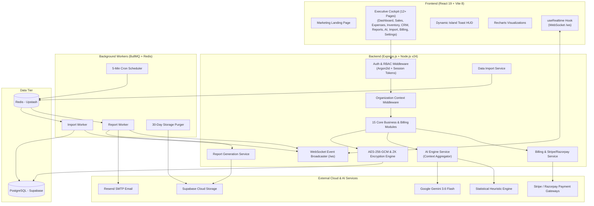

<div align="center">

# 🚀 DecisionOS

### *Enterprise AI-Powered Business Intelligence & Predictive Analytics Operating System*

[](https://nodejs.org/)
[](https://reactjs.org/)
[](https://vitejs.dev/)
[](https://supabase.com/)
[](https://upstash.com/)
[](https://ai.google.dev/)
[](https://stripe.com/)
[](https://bullmq.io/)
[](https://www.docker.com/)
[](https://opensource.org/licenses/MIT)

---

[Overview](#-overview) • [Key Capabilities](#-key-capabilities) • [System Architecture](#-system-architecture) • [Frontend Suite](#-frontend-suite) • [Billing & Monetization](#-billing--subscription-engine) • [Real-Time Event Engine](#-real-time-events--websockets) • [Tech Stack](#-tech-stack) • [Docker Deployment](#-docker--production-deployment-one-click) • [Quick Start](#-quick-start-local-development) • [API Reference](#-api-reference) • [Test Suite](#-test-suite)

---

</div>

> [!NOTE]
> **DecisionOS** is an enterprise-grade, full-stack, multi-tenant SaaS platform that unifies fragmented operational spreadsheets, sales logs, and ERP datasets into an executive decision intelligence cockpit. Engineered with **React 19**, **Express.js**, **Supabase PostgreSQL**, **Google Gemini 3.6 Flash**, **BullMQ async workers**, **WebSocket real-time streaming**, **AES-256-GCM encryption**, **Stripe & Razorpay multi-gateway billing**, and automated **PDF/CSV/Excel** reporting.

---

## 🌟 Overview

Modern SMEs and growing enterprises frequently suffer from siloed spreadsheets, missed stockouts, unmonitored customer churn, and delayed financial reporting. **DecisionOS** provides a comprehensive, centralized decision intelligence operating system:

- **Full-Stack Enterprise REST API** — Express.js + Prisma ORM + Supabase PostgreSQL with 70+ tested endpoints.
- **Dual-Engine AI Intelligence** — Google Gemini 3.6 Flash coupled with internal anomaly algorithms (Z-score analysis, RFM customer segmentation, linear regression forecasting).
- **Multi-Gateway Billing & Quotas** — Stripe & Razorpay billing engine with automated tier gating (FREE, PRO, ENTERPRISE), customer portal, encrypted secrets, and HMAC webhook verification.
- **Real-Time Multi-Tenant WebSocket Engine** — Sub-second event broadcasting for stock alerts, background job completions, and live notification pushes with strict tenant isolation.
- **Automated Multi-Format Report Builder** — Generates styled PDF, multi-sheet Excel (`.xlsx`), and streaming CSV reports on recurring cron schedules (Daily, Weekly, Monthly) with automated 30-day cloud retention and Resend SMTP delivery.
- **Resilient Data Import Pipeline** — Multer + BullMQ + Redis background workers with fuzzy column detection, row-level error isolation (`PARTIAL` commits), and sample templates.
- **Multi-Tenant Security & AES-256-GCM** — Complete tenant isolation via `organizationId` database scoping, memory-hard Argon2id session authentication, zero-knowledge verification, and granular RBAC.
- **High-End Executive UI** — React 19 + Vite 8 with 12+ production pages, responsive Recharts financial visualizations, and a floating **Dynamic Island HUD notification pill**.

---

## 🚀 Key Capabilities

<table>
  <tr>
    <td width="50%">
      <h3>📊 Business Data Suite</h3>
      <ul>
        <li><b>Customers CRM</b>: RFM segmentation, customer lifetime revenue (LTV), churn risk detection, and search/sort.</li>
        <li><b>Products Catalogue</b>: SKU uniqueness, unit economics, cost price, and gross margin tracking.</li>
        <li><b>Sales Ledger</b>: Atomic inventory decrement & customer revenue rollups on transaction commits.</li>
        <li><b>Expense Tracking</b>: Multi-category ledger with MoM surge detection and category distribution donut charts.</li>
        <li><b>Inventory Velocity</b>: Reorder alerts, stockout warnings, dynamic progress indicators, and SKU health status.</li>
      </ul>
    </td>
    <td width="50%">
      <h3>🧠 AI Engine (Gemini 3.6 Flash)</h3>
      <ul>
        <li><b>Anomaly Detection</b>: Real-time alerts for revenue drops, expense spikes (>25%), and stockout risks.</li>
        <li><b>Churn Risk Matrix</b>: Flags high-value dormant accounts with inactivity >45 days.</li>
        <li><b>Predictive Forecasting</b>: 3-month linear regression forward revenue trajectory.</li>
        <li><b>"Ask DecisionOS"</b>: Natural language Q&A querying live business data across all modules.</li>
        <li><b>Dual-Engine Resiliency</b>: Automatic fallback to internal heuristic statistical engine when offline.</li>
      </ul>
    </td>
  </tr>
  <tr>
    <td width="50%">
      <h3>💳 Billing & Subscription Engine</h3>
      <ul>
        <li><b>Multi-Gateway Support</b>: Built-in support for Stripe & Razorpay checkouts.</li>
        <li><b>Tiered Plans Matrix</b>: FREE, STARTER, PRO, and ENTERPRISE tiers with monthly & yearly billing.</li>
        <li><b>Dynamic Quota Tracking</b>: Real-time meters for team seats, AI queries, import jobs, and storage usage.</li>
        <li><b>Customer Billing Portal</b>: Self-service credit card updates, subscription management, and cancellation.</li>
        <li><b>Invoices & Receipts Ledger</b>: Comprehensive downloadable transaction ledger.</li>
        <li><b>HMAC Webhook Security</b>: Cryptographically verified webhook handling for instant provisioning.</li>
      </ul>
    </td>
    <td width="50%">
      <h3>⚡ Real-Time WebSocket Streaming</h3>
      <ul>
        <li><b>Multi-Tenant Channels</b>: Isolated WebSocket channels (`/ws`) ensuring zero cross-tenant data leakage.</li>
        <li><b>Live Background Notifications</b>: Instant UI toast alerts when BullMQ import or report jobs complete.</li>
        <li><b>Stock & Health Triggers</b>: Immediate push broadcasts when inventory breaches reorder safety levels.</li>
        <li><b>Heartbeat & Auto-Reconnect</b>: Resilient connection lifecycles with client-side exponential reconnect.</li>
      </ul>
    </td>
  </tr>
  <tr>
    <td width="50%">
      <h3>📑 Automated Report Engine</h3>
      <ul>
        <li><b>Vector PDF Reports (PDFKit)</b>: Rendered executive summaries with KPI metric cards, data tables, and alert badges.</li>
        <li><b>Excel Workbooks (ExcelJS)</b>: Multi-sheet <code>.xlsx</code> spreadsheets with styled headers & auto-fit columns.</li>
        <li><b>Streaming CSV</b>: Multi-section CSV exports for fast data ingestion.</li>
        <li><b>Cron Scheduler</b>: Automated Daily, Weekly, and Monthly background triggers.</li>
        <li><b>30-Day Cloud File Retention</b>: Automated daily background purger for expired exports.</li>
        <li><b>Email Delivery</b>: Branded HTML notifications via Resend SMTP with 1-hour signed cloud download URLs.</li>
      </ul>
    </td>
    <td width="50%">
      <h3>📥 Data Import Pipeline</h3>
      <ul>
        <li><b>Fuzzy Header Detection</b>: Auto-maps messy column names across all 5 entity types.</li>
        <li><b>Background Ingestion</b>: BullMQ + Redis job worker with exponential backoff.</li>
        <li><b>Error Isolation</b>: Valid rows commit immediately; invalid rows flagged for review (<code>PARTIAL</code> status).</li>
        <li><b>Template Downloads</b>: Pre-formatted CSV sample generators for every model.</li>
      </ul>
    </td>
  </tr>
  <tr>
    <td width="50%">
      <h3>🔐 Multi-Tenancy & Cryptography</h3>
      <ul>
        <li><b>Strict Tenant Isolation</b>: Every query hard-scoped by <code>organizationId</code>.</li>
        <li><b>AES-256-GCM Encryption</b>: Database field encryption for sensitive payment tokens and secrets.</li>
        <li><b>Role Permissions</b>: <code>OWNER</code>, <code>ADMIN</code>, <code>ANALYST</code>, <code>VIEWER</code>.</li>
        <li><b>Team Invitations</b>: Expiring cryptographically secure invite tokens with email dispatch.</li>
        <li><b>Secure Auth</b>: Memory-hard Argon2id password hashing + HTTP-only signed cookies.</li>
        <li><b>Audit Trail</b>: Immutable audit logging for sensitive data mutations and file exports.</li>
      </ul>
    </td>
    <td width="50%">
      <h3>💎 Executive Cockpit UI</h3>
      <ul>
        <li><b>12+ Production Pages</b>: Landing, Dashboard, Sales, Expenses, Inventory, Customers, Reports, AI Insights, Data Import, Billing, Notifications, Settings, and Auth.</li>
        <li><b>Dynamic Island HUD Toasts</b>: Floating glassmorphic pill notifications with spring physics.</li>
        <li><b>Live Visualizations</b>: Responsive Recharts line, area, and stacked bar graphs.</li>
        <li><b>Theme Engine</b>: Dark and Light modes with automatic OS system preference detection.</li>
      </ul>
    </td>
  </tr>
</table>

---

## 🏗️ System Architecture



---

## 🖥️ Frontend Suite

The frontend is built with **React 19** and **Vite 8**, featuring 12+ production-ready pages with custom CSS design tokens, dynamic dark/light theme switching, and real-time WebSocket state management:

| Page | Route | Features & Capabilities |
|---|---|---|
| **Landing** | `/` | High-converting marketing landing page with feature deep-dives, interactive architecture preview, live pricing tiers, and direct onboarding triggers. |
| **Dashboard** | `/dashboard` | Executive cockpit with 4 key KPI cards, Revenue Trend chart, Expense Breakdown, Top Customers, and AI quick insights. |
| **Sales** | `/sales` | Paginated sales transactions ledger with total revenue summaries, product search, and status badges. |
| **Expenses** | `/expenses` | Expense tracking with category donut breakdown, monthly averages, and category filters. |
| **Inventory** | `/inventory` | SKU stock control, dynamic stock-level progress bars, low-stock warnings, and unit cost rollups. |
| **Customers** | `/customers` | CRM directory with customer lifetime revenue, order counts, RFM rankings, and search/sort. |
| **Reports** | `/reports` | 3-tab report center for on-demand generation (PDF/Excel/CSV), export history with signed downloads, and automated cron schedules. |
| **AI Insights** | `/insights` | Predictive insights dashboard with Business Health Score (0-100), risk filters, and natural language Q&A. |
| **Data Import** | `/import` | Drag-and-drop CSV/XLSX file uploader with fuzzy column detection, 5-row preview, sample templates, and live progress streaming. |
| **Billing & Plans** | `/billing` | Subscription plan management (FREE, PRO, ENTERPRISE), checkout redirects, live usage quota progress bars (Seats, AI Calls, Imports, Storage), customer portal launcher, and invoice ledger. |
| **Notifications** | `/notifications` | Live notification inbox with unread count badges, real-time push ingestion, and filterable alert types. |
| **Settings** | `/settings` | 5-tab settings console: Profile editing, Organization details, Team member roles & invite modal, Notification toggles, Theme switcher, and Session termination. |
| **Accept Invitation** | `/invite/accept`, `/accept-invitation` | Team invitation acceptance flow with role preview and organization onboarding. |
| **Auth Suite** | `/login`, `/register` | Multi-step onboarding with profile photo upload, password complexity validation, and animated brand identity. |

---

## 💳 Stripe Billing & Subscription Integration

DecisionOS features an enterprise-grade Stripe billing architecture supporting multi-currency payments, automated plan provisioning, and subscription lifecycle management:

```
┌────────────────────────────────────────────────────────────────────────┐
│                        DecisionOS Pricing Tiers                        │
├─────────────────┬──────────────┬──────────────┬────────────────────────┤
│ Plan Tier       │ Monthly Price│ Yearly Price │ Included Quotas        │
├─────────────────┼──────────────┼──────────────┼────────────────────────┤
│ 🆓 FREE         │ ₹0 / $0      │ ₹0 / $0      │ 3 Seats, 10,000 AI,    │
│                 │              │              │ 5 Imports, 100MB Store │
├─────────────────┼──────────────┼──────────────┼────────────────────────┤
│ 🚀 GROWTH PRO   │ ₹2,999 / $39 │ ₹2,399 / $29 │ 15 Seats, 250,000 AI,  │
│                 │              │ (20% Off)    │ 50 Imports, 5GB Store  │
├─────────────────┼──────────────┼──────────────┼────────────────────────┤
│ 🏢 ENTERPRISE   │ ₹8,999 / $119│ ₹7,199 / $95 │ Unlimited Seats/Calls, │
│                 │              │              │ 100GB Encrypted Store  │
└─────────────────┴──────────────┴──────────────┴────────────────────────┘
```

### 🔐 Stripe Architecture & Security Specifications
- **Hosted Checkout**: Direct redirect to official Stripe Checkout with dynamic line items, automatic promotion codes, and DecisionOS branding.
- **Raw Buffer HMAC Verification**: Webhook payloads are captured as raw bytes via `express.raw()` before JSON parsing and cryptographically verified against `STRIPE_WEBHOOK_SECRET`.
- **Atomic DB Transactions**: All database updates (`subscription.upsert`, `payment.create`, and `auditLog.create`) execute inside `prisma.$transaction`.
- **Replay & Idempotency Protection**: Duplicate webhook deliveries are detected by invoice ID to prevent redundant payment records.
- **AES-256-GCM Encryption**: Customer identifiers (`cus_...`) are encrypted at rest with authentication tags for tamper detection and privacy masking (`•••• 4242`).
- **Customer Reuse**: Existing Stripe customers are mapped to avoid creating duplicate customer records in Stripe.
- **Customer Billing Portal**: One-click session generation for self-service payment method updates, invoice downloads, and plan changes.

### ⚡ Supported Stripe Webhook Events
| Event | Action Taken |
|---|---|
| `checkout.session.completed` | Provisions plan tier, stores customer ID, and records initial invoice |
| `invoice.payment_succeeded` | Records recurring renewals and extends subscription period |
| `invoice.payment_failed` | Transitions subscription to `PAST_DUE` and alerts team via WebSocket |
| `customer.subscription.updated` | Synchronizes portal-driven plan upgrades/downgrades |
| `customer.subscription.deleted` | Automatically reverts organization to `FREE` tier on cancellation |

---


## ⚡ Real-Time Events & WebSockets

DecisionOS integrates a zero-configuration, multi-tenant WebSocket architecture:

- **Route**: `ws://<host>:<port>/ws?token=<sessionToken>`
- **Strict Isolation**: WebSocket connections are registered under the authenticated user's `organizationId`. Messages sent via `broadcastToOrg(orgId, event, data)` only reach clients in that organization.
- **Event Types**:
  - `CONNECTED` — Initial handshake confirmation.
  - `IMPORT_COMPLETED` / `IMPORT_FAILED` — BullMQ data import queue state updates.
  - `REPORT_READY` — Automated/on-demand report generation completion.
  - `STOCK_ALERT` — Real-time warning when inventory levels dip below threshold.
  - `INSIGHT_GENERATED` — New AI anomaly or risk detected.

---

## 🛠️ Tech Stack

### Backend
| Component | Technology | Version | Purpose |
|---|---|:---:|---|
| **Runtime** | Node.js | v24 | High-performance JavaScript runtime |
| **Framework** | Express.js | 4.x | HTTP REST API & middleware |
| **ORM** | Prisma | 5.22 | Type-safe PostgreSQL client & migrations |
| **Primary Database** | PostgreSQL (Supabase) | 15+ | Relational multi-tenant data store |
| **Queue / Cache** | Redis (Upstash) | — | BullMQ job queue & distributed locks |
| **Background Jobs** | BullMQ | 6.x | Async worker queues for imports, reports, & file purging |
| **Realtime Engine** | WebSocket (`ws`) | 8.x | Multi-tenant live event streaming |
| **Payments & Billing** | Stripe SDK + Razorpay | 16.x | Checkout sessions, billing portal, & webhook verification |
| **Cryptography** | AES-256-GCM + Argon2id | 0.45 | Data-at-rest encryption & memory-hard password hashing |
| **AI LLM** | Google Gemini | 3.6 Flash | Predictive analytics & natural language Q&A |
| **PDF Generation** | PDFKit | 0.19 | Programmatic vector PDF reports |
| **Excel Generation** | ExcelJS | 4.4 | Formatted multi-sheet spreadsheets (`.xlsx`) |
| **CSV Generation** | @fast-csv/format | 5.0 | Streaming CSV serialization |
| **Email Delivery** | Nodemailer + Resend | 9.x | Branded HTML transactional emails |
| **Validation** | Zod | 4.x | Strict runtime request schema validation |
| **Security** | Helmet + RateLimit | — | Secure HTTP headers & brute-force protection |

### Frontend
| Component | Technology | Version | Purpose |
|---|---|:---:|---|
| **Framework** | React | 19 | UI component architecture |
| **Build Tool** | Vite | 8.x | High-speed HMR development & build |
| **Styling** | Vanilla CSS + Design Tokens | — | Custom glassmorphism, responsive grid, & CSS custom properties |
| **Charts** | Recharts | 3.x | Financial charts, revenue trends, & expense distributions |
| **HTTP Client** | Axios | 1.x | REST API integration with `withCredentials: true` |
| **Realtime Client** | Native WebSocket Hook | — | Auto-reconnecting real-time state synchronizer |
| **Icons** | Lucide React | — | Modern SVG iconography |
| **Notifications** | react-hot-toast + Custom HUD | — | Sonner-inspired floating Dynamic Island pill toasts |

---

## 📂 Project Structure

```
DecisionOS/
├── 📂 backend/
│   ├── 📂 prisma/
│   │   ├── schema.prisma              # Database schema (10 modules, 25+ models)
│   │   ├── migrations/                # Schema migrations (file retention, billing)
│   │   └── seed.js                    # Plan tiers & super-admin seed script
│   ├── 📂 src/
│   │   ├── 📂 config/
│   │   │   ├── env.js                 # Validated environment variables (Zod)
│   │   │   ├── gemini.js              # Google Gemini 3.6 Flash client & fallback
│   │   │   ├── queue.js               # BullMQ queue configurations
│   │   │   └── redis.js               # Redis connection singleton
│   │   ├── 📂 lib/
│   │   │   ├── aiContextBuilder.js    # Multi-tenant AI metrics aggregator
│   │   │   ├── anomalyDetector.js     # Statistical anomaly detection algorithms
│   │   │   ├── columnDetector.js      # Fuzzy header matcher for imports
│   │   │   ├── crypto.js              # Secure token generator
│   │   │   ├── email.js               # Resend SMTP email delivery
│   │   │   ├── encryption.js          # AES-256-GCM encryption & masking
│   │   │   ├── fileParser.js          # CSV & Excel streaming parser
│   │   │   ├── forecaster.js          # Linear regression revenue forecaster
│   │   │   ├── prisma.js              # Prisma client singleton
│   │   │   ├── realtime.js            # WebSocket server & org broadcaster
│   │   │   ├── 📂 reportBuilder/      # Report generation engine
│   │   │   │   ├── csvBuilder.js      # Multi-section CSV builder
│   │   │   │   ├── pdfBuilder.js      # PDFKit vector PDF builder
│   │   │   │   ├── reportDataFetcher.js # Cross-module context aggregator
│   │   │   │   └── xlsxBuilder.js     # ExcelJS multi-sheet formatted workbook
│   │   │   ├── response.js            # Standardized API response envelope
│   │   │   └── templateGenerator.js   # Sample CSV template generator
│   │   ├── 📂 middleware/
│   │   │   ├── auth.middleware.js     # Session cookie verification
│   │   │   ├── org.middleware.js      # Tenant context injection
│   │   │   ├── rbac.middleware.js     # Permission-based access gate
│   │   │   ├── rateLimit.middleware.js # Express rate limiters
│   │   │   └── errorHandler.js        # Global error interceptor
│   │   ├── 📂 modules/
│   │   │   ├── 📂 ai/                 # AI Engine (insights, forecasting, ask)
│   │   │   ├── 📂 analytics/          # Executive P&L & chart aggregations
│   │   │   ├── 📂 auth/               # Registration, login, sessions
│   │   │   ├── 📂 billing/            # Plans, Stripe checkout, portal, quotas
│   │   │   ├── 📂 customers/          # Customer CRM & RFM scoring
│   │   │   ├── 📂 expenses/           # Expense ledger & surge alerts
│   │   │   ├── 📂 imports/            # Data import pipeline & preview
│   │   │   ├── 📂 inventory/          # Stock control & reorder tracking
│   │   │   ├── 📂 invitations/        # Team invitation tokens & dispatch
│   │   │   ├── 📂 members/            # Team member roles & permissions
│   │   │   ├── 📂 organizations/      # Multi-tenant organization manager
│   │   │   ├── 📂 products/           # Product catalogue & margins
│   │   │   ├── 📂 realtime/           # WebSocket broadcast endpoints
│   │   │   ├── 📂 reports/            # Automated Report Generation & cleanup
│   │   │   └── 📂 sales/              # Sales transactions with inventory decrements
│   │   ├── 📂 workers/
│   │   │   ├── import.worker.js       # BullMQ import queue processor
│   │   │   ├── report.worker.js       # BullMQ report queue processor
│   │   │   ├── report.scheduler.js    # 5-minute cron scheduler & daily cleanup
│   │   │   └── 📂 processors/         # Entity batch processors
│   │   ├── app.js                     # Express app configuration
│   │   └── server.js                  # Server entry, HTTP + WS & graceful shutdown
│   ├── 📂 test/
│   │   ├── business_data.test.js      # 19 tests — Business Data Suite
│   │   ├── import_pipeline.test.js    # 13 tests — Import Pipeline & BullMQ
│   │   ├── ai_engine.test.js          # 14 tests — AI Engine & Anomaly Detection
│   │   ├── reports.test.js            # 17 tests — Automated Report Generation
│   │   ├── billing.test.js            # 28 tests — Stripe Billing, Quotas & Crypto
│   │   ├── realtime.test.js           # 8 tests  — Multi-Tenant WebSocket Engine
│   │   └── e2ee.test.js               # 4 tests  — Cryptographic & Zero-Knowledge Suite
│   ├── Dockerfile                     # Multi-stage production backend container
│   ├── docker-entrypoint.sh           # DB migration & startup runner
│   └── package.json
│
├── 📂 frontend/
│   ├── 📂 src/
│   │   ├── 📂 components/
│   │   │   ├── 📂 layout/             # AppLayout, Sidebar, ProtectedRoute
│   │   │   └── 📂 ui/                 # CustomToast (Dynamic Island HUD), StatCards
│   │   ├── 📂 context/                # AuthContext, ThemeContext, NotificationContext
│   │   ├── 📂 lib/                    # Central Axios API instance & custom hooks
│   │   │   ├── api.js                 # Base Axios configuration
│   │   │   └── 📂 hooks/              # useApi, useDashboard, useAI, useReports, useRealtime
│   │   ├── 📂 pages/                  # 12+ production pages + Auth suite
│   │   │   ├── 📂 Auth/               # Login, Register, AcceptInvitation, AnimatedLogo
│   │   │   ├── AIInsights.jsx         # Predictive insights & Q&A
│   │   │   ├── Billing.jsx            # Subscription plans, quotas, invoices
│   │   │   ├── Customers.jsx          # CRM & RFM directory
│   │   │   ├── Dashboard.jsx          # Main executive cockpit
│   │   │   ├── DataImport.jsx         # Drag-and-drop CSV/XLSX pipeline
│   │   │   ├── Expenses.jsx           # Expense ledger & surge charts
│   │   │   ├── Inventory.jsx          # Stock control & reorder tracking
│   │   │   ├── Landing.jsx            # Marketing landing page
│   │   │   ├── Notifications.jsx      # Real-time alert inbox
│   │   │   ├── Reports.jsx            # Multi-format report builder
│   │   │   ├── Sales.jsx              # Sales transaction ledger
│   │   │   └── Settings.jsx           # 5-tab settings & team management
│   │   ├── App.jsx                    # Routing & global providers
│   │   └── index.css                  # Global design system & theme tokens
│   ├── Dockerfile                     # Production Nginx frontend container
│   ├── nginx.conf                     # Nginx reverse proxy configuration
│   └── package.json
│
├── docker-compose.yml                 # Production Docker orchestration (4 services)
├── docker-compose.dev.yml             # Local dev Docker orchestration
├── deploy.sh                          # One-click Linux / macOS / Cloud VM deployment
├── deploy.ps1                         # One-click Windows PowerShell deployment
├── .env.docker.example                # Docker environment configuration template
└── README.md
```

---

## 🐳 Docker & Production Deployment (One-Click)

DecisionOS includes complete multi-stage Dockerfiles, Nginx reverse proxy configurations, and Docker Compose orchestration for one-command production deployments on any cloud VM (AWS EC2, DigitalOcean, Hetzner, GCP, Azure) or local Docker Desktop.

```
┌────────────────────────────────────────────────────────────────────────┐
│                        DecisionOS Docker Stack                         │
│                                                                        │
│  ┌───────────────────────┐             ┌────────────────────────────┐  │
│  │   decisionos-frontend │             │    decisionos-backend      │  │
│  │   (Nginx 1.27 Alpine) │ ──/api/v1─> │   (Node.js 24 Alpine)      │  │
│  │   Port: 80 / 443      │ ───/ws────> │   Port: 5000               │  │
│  └───────────────────────┘             └─────────────┬──────────────┘  │
│                                                      │                 │
│                                        ┌─────────────┴──────────────┐  │
│                                        │                            │  │
│                            ┌───────────▼──────────┐   ┌─────────────▼┐ │
│                            │ decisionos-postgres  │   │ decisionos-  │ │
│                            │ (PostgreSQL 16)      │   │ redis (v7)   │ │
│                            │ Volume: pg_data      │   │ Volume: r_data │
│                            └──────────────────────┘   └──────────────┘ │
└────────────────────────────────────────────────────────────────────────┘
```

### 🚀 One-Command Launch

#### Option A: Using the Automated Deployment Script
```bash
# On Linux / macOS / Cloud VMs:
chmod +x deploy.sh
./deploy.sh

# On Windows (PowerShell):
powershell -ExecutionPolicy Bypass -File .\deploy.ps1
```

#### Option B: Using Docker Compose Directly
```bash
# 1. Copy the production environment template
cp .env.docker.example .env

# 2. Build and launch all 4 services in detached mode
docker compose up -d --build

# 3. View real-time container logs
docker compose logs -f
```

### 🌐 Container Service Endpoints
- **Frontend Web App**: `http://localhost` (Port 80)
- **Backend API & Health Check**: `http://localhost:5000/api/v1` & `http://localhost:5000/health`
- **WebSocket Streaming**: `ws://localhost:5000/ws` (or proxied via `ws://localhost/ws`)
- **PostgreSQL Database**: `localhost:5432` (Internal Docker network)
- **Redis Cache & BullMQ Queue**: `localhost:6379` (Internal Docker network)

---

## ⚡ Quick Start (Local Development)

### Prerequisites
- **Node.js**: `v18.0.0` or higher (`v24` recommended)
- **PostgreSQL**: PostgreSQL 15+ (or free [Supabase](https://supabase.com) instance)
- **Redis**: Redis 6+ (or free [Upstash](https://upstash.com) Redis)
- **Google Gemini API Key**: Free from [Google AI Studio](https://aistudio.google.com/app/apikey)

### 1. Clone the Repository

```bash
git clone https://github.com/souvikx18/DecisionOS.git
cd DecisionOS
```

### 2. Configure Backend Environment

```bash
cd backend
cp .env.example .env
```

Edit `backend/.env`:

```env
# Server
NODE_ENV=development
PORT=3001
API_URL=http://localhost:3001
FRONTEND_URL=http://localhost:5173
ALLOWED_ORIGINS=http://localhost:5173

# Database (Supabase PostgreSQL)
DATABASE_URL="postgresql://postgres:<password>@db.<ref>.supabase.co:5432/postgres"

# Redis (Upstash)
REDIS_URL="rediss://default:<password>@<host>.upstash.io:6379"

# Auth & Cryptography
COOKIE_SECRET="super-secret-random-32-byte-hex-string-here"
ENCRYPTION_KEY="0123456789abcdef0123456789abcdef0123456789abcdef0123456789abcdef"
SESSION_TTL_SECONDS=604800

# Supabase Storage
SUPABASE_URL=https://<ref>.supabase.co
SUPABASE_ANON_KEY=<anon-key>
SUPABASE_SERVICE_KEY=<service-role-key>
STORAGE_BUCKET=decisionos-files

# Email (Resend SMTP)
RESEND_API_KEY=re_xxxxxxxxxxxx
EMAIL_FROM=decisionos@resend.dev

# AI Engine
AI_PROVIDER=gemini
GEMINI_API_KEY=<your-gemini-api-key>

# Billing (Stripe / Razorpay)
STRIPE_SECRET_KEY=sk_test_xxxxxxxxxxxx
STRIPE_WEBHOOK_SECRET=whsec_xxxxxxxxxxxx
RAZORPAY_KEY_ID=rzp_test_xxxxxxxxxxxx
RAZORPAY_KEY_SECRET=xxxxxxxxxxxx
RAZORPAY_WEBHOOK_SECRET=xxxxxxxxxxxx

# Retention & Export Settings
REPORT_FILE_RETENTION_DAYS=30
```

### 3. Initialize the Database

```bash
# Install backend dependencies
npm install

# Push Prisma schema to Supabase & generate client
npm run db:push

# Seed billing tiers & initial administrator
npm run db:seed
```

### 4. Run the Backend

```bash
npm run dev
# Server listening on http://localhost:3001
# WebSocket server active on ws://localhost:3001/ws
# BullMQ Import & Report Workers + Schedulers automatically initialize
```

### 5. Run the Frontend

```bash
cd ../frontend
npm install
npm run dev
# Frontend live at http://localhost:5173
```

---

## 🔑 Quick Demo Credentials

For rapid local testing and evaluation:

| Parameter | Demo Value |
|---|---|
| **URL** | `http://localhost:5173/login` |
| **Email** | `test@decisionos.com` |
| **Password** | `Password123!` |
| **Organization** | `Acme Test Corp` |
| **Role** | `OWNER` |

---

## 📡 API Reference

All endpoints are versioned under `/api/v1` and use session-cookie authentication with credentials.

### Authentication (`/auth`)
| Method | Endpoint | Access | Description |
|---|---|:---:|---|
| `POST` | `/auth/signup` | Public | Register new user account |
| `POST` | `/auth/login` | Public | Authenticate user & set HTTP-only session cookie |
| `POST` | `/auth/logout` | Authenticated | Terminate session & clear cookies |
| `POST` | `/auth/logout-all` | Authenticated | Terminate all active sessions across devices |
| `GET` | `/auth/me` | Authenticated | Retrieve current user profile & org list |
| `POST` | `/auth/change-password` | Authenticated | Change user password |

### Billing & Subscriptions (`/billing`)
| Method | Endpoint | Required Role | Description |
|---|---|:---:|---|
| `GET` | `/billing/plans` | `VIEW_DATA` | List plans catalog & active organization tier |
| `GET` | `/billing/subscription` | `VIEW_DATA` | Current subscription status & live quota meters |
| `POST` | `/billing/checkout` | `OWNER` | Create Stripe / Razorpay checkout session |
| `POST` | `/billing/portal` | `OWNER` | Generate customer billing management portal URL |
| `GET` | `/billing/invoices` | `VIEW_DATA` | List payment ledger and invoices |
| `POST` | `/billing/webhook/stripe` | Public | Process cryptographically signed Stripe webhooks |
| `POST` | `/billing/webhook/razorpay`| Public | Process HMAC SHA-256 signed Razorpay webhooks |

### Team Invitations & Members (`/invitations`, `/members`)
| Method | Endpoint | Required Role | Description |
|---|---|:---:|---|
| `POST` | `/invitations` | `MANAGE_ORG` | Send team invitation email with role assignment |
| `GET` | `/invitations` | `VIEW_DATA` | List pending invitations for active organization |
| `DELETE` | `/invitations/:id` | `MANAGE_ORG` | Revoke pending invitation |
| `POST` | `/invitations/accept` | Authenticated | Accept invitation token and join organization |
| `GET` | `/members` | `VIEW_DATA` | List organization team members |
| `PATCH` | `/members/:id/role` | `MANAGE_ORG` | Update member role (`ADMIN`, `ANALYST`, `VIEWER`) |
| `DELETE` | `/members/:id` | `MANAGE_ORG` | Remove member from organization |

### Business Data Suite
| Method | Endpoint | Required Role | Description |
|---|---|:---:|---|
| `GET` | `/customers` | `VIEW_DATA` | List customers (paginated, searchable, sorted) |
| `POST` | `/customers` | `MANAGE_DATA` | Create new customer with RFM parameters |
| `GET` | `/customers/:id` | `VIEW_DATA` | Get customer details + lifetime value |
| `PATCH` | `/customers/:id` | `MANAGE_DATA` | Update customer details |
| `DELETE` | `/customers/:id` | `MANAGE_DATA` | Archive customer |
| `GET` | `/products` | `VIEW_DATA` | List product catalogue with margin rollups |
| `POST` | `/products` | `MANAGE_DATA` | Create product (enforces unique SKU) |
| `GET` | `/sales` | `VIEW_DATA` | List sales ledger with filtering |
| `POST` | `/sales` | `MANAGE_DATA` | Record sale (atomic inventory decrement & customer LTV sync) |
| `GET` | `/expenses` | `VIEW_DATA` | List expense records with category filter |
| `GET` | `/expenses/categories` | `VIEW_DATA` | Category breakdown totals |
| `POST` | `/expenses` | `MANAGE_DATA` | Record new expense |
| `GET` | `/inventory` | `VIEW_DATA` | List inventory with stockout & reorder warnings |
| `PATCH` | `/inventory/:id/adjust` | `MANAGE_DATA` | Adjust stock quantity |

### Analytics (`/analytics`)
| Method | Endpoint | Required Role | Description |
|---|---|:---:|---|
| `GET` | `/analytics/summary` | `VIEW_DATA` | Executive P&L summary & business health |
| `GET` | `/analytics/charts/revenue-trend` | `VIEW_DATA` | 6-month monthly revenue & profit trend |
| `GET` | `/analytics/charts/expense-breakdown` | `VIEW_DATA` | Category-wise expense distribution |

### AI Engine (`/ai`)
| Method | Endpoint | Required Role | Description |
|---|---|:---:|---|
| `POST` | `/ai/generate` | `VIEW_DATA` | Trigger full AI anomaly & insight scan |
| `GET` | `/ai/insights` | `VIEW_DATA` | List insights with severity/type filters |
| `GET` | `/ai/insights/summary` | `VIEW_DATA` | Business health score (0–100) & risk count |
| `PATCH` | `/ai/insights/:id/read` | `VIEW_DATA` | Mark insight as read |
| `PATCH` | `/ai/insights/:id/dismiss` | `VIEW_DATA` | Dismiss insight from active cockpit |
| `POST` | `/ai/ask` | `VIEW_DATA` | Ask natural language questions against live data |
| `GET` | `/ai/forecast/revenue` | `VIEW_DATA` | 3-month predictive revenue forecast |

### Automated Reports & Schedules (`/reports`)
| Method | Endpoint | Required Role | Description |
|---|---|:---:|---|
| `POST` | `/reports/generate` | `MANAGE_DATA` | Trigger on-demand report (PDF/CSV/XLSX) |
| `GET` | `/reports` | `VIEW_DATA` | List generated reports with pagination & filters |
| `GET` | `/reports/:id` | `VIEW_DATA` | Get report metadata and export formats |
| `GET` | `/reports/:id/download/:exportId` | `VIEW_DATA` | Generate 1-hour signed cloud download URL |
| `DELETE` | `/reports/:id` | `MANAGE_DATA` | Delete report record & purge cloud storage files |
| `POST` | `/reports/schedules` | `MANAGE_DATA` | Create recurring schedule (Daily/Weekly/Monthly) |
| `GET` | `/reports/schedules` | `VIEW_DATA` | List all active automated report schedules |
| `PATCH` | `/reports/schedules/:id` | `MANAGE_DATA` | Update schedule recipients, frequency, or toggle active |
| `DELETE` | `/reports/schedules/:id` | `MANAGE_DATA` | Delete recurring report schedule |

### Data Import Pipeline (`/imports`)
| Method | Endpoint | Required Role | Description |
|---|---|:---:|---|
| `POST` | `/imports/upload` | `MANAGE_DATA` | Upload CSV/XLSX file (20MB max) |
| `POST` | `/imports/preview` | `MANAGE_DATA` | Extract 5-row preview & detect columns |
| `POST` | `/imports/:id/start` | `MANAGE_DATA` | Queue BullMQ background import job |
| `GET` | `/imports/:id/status` | `VIEW_DATA` | Poll import progress & valid/error row counts |
| `GET` | `/imports/templates/:type` | `VIEW_DATA` | Download pre-formatted CSV sample template |

### Real-Time Streaming (`/ws`)
| Channel | Direction | Protocol | Description |
|---|---|:---:|---|
| `/ws?token=<session>` | Client ↔ Server | WebSocket | Multi-tenant bidirectional event streaming |
| `broadcastToOrg(orgId)`| Server → Org | Internal | Broadcast job status, stock triggers, and report readiness |
| `sendToUser(userId)` | Server → User | Internal | Push direct user alerts and notification badges |

---

## 🧪 Test Suite

DecisionOS includes an extensive end-to-end integration and cryptographic test suite executed against live PostgreSQL, Redis, Express, and WebSocket instances:

```bash
cd backend

# Execute all integration test suites
node test/business_data.test.js      # Business Data Suite (19 tests)
node test/import_pipeline.test.js    # Data Import Pipeline (13 tests)
node test/ai_engine.test.js          # AI Engine & Anomaly Detection (14 tests)
node test/reports.test.js            # Automated Report Generation (17 tests)
node test/billing.test.js            # Stripe / Razorpay & Quotas (19 tests)
node test/realtime.test.js           # Multi-Tenant WebSocket Engine (8 tests)
node test/e2ee.test.js               # Cryptographic & Zero-Knowledge (4 tests)
```

### Test Verification Summary

| Test Suite | File | Tests Passed | Assertions | Status |
|---|---|:---:|:---:|:---:|
| **Business Data** | `test/business_data.test.js` | 19 / 19 | 19 | ✅ **100% PASSED** |
| **Data Import Pipeline** | `test/import_pipeline.test.js` | 13 / 13 | 13 | ✅ **100% PASSED** |
| **AI Engine & Analytics** | `test/ai_engine.test.js` | 14 / 14 | 14 | ✅ **100% PASSED** |
| **Automated Report Engine** | `test/reports.test.js` | 17 / 17 | 43 | ✅ **100% PASSED** |
| **Billing & Quota Engine** | `test/billing.test.js` | 19 / 19 | 19 | ✅ **100% PASSED** |
| **Real-Time WebSockets** | `test/realtime.test.js` | 8 / 8 | 8 | ✅ **100% PASSED** |
| **Cryptographic & E2EE** | `test/e2ee.test.js` | 4 / 4 | 7 | ✅ **100% PASSED** |
| **Total Test Coverage** | **All 7 Test Suites** | **94 / 94** | **123** | ✅ **100% PASSED** |

---

## 🛡️ Security & Multi-Tenancy

```
Multi-Tenant Security Architecture:
┌────────────────────────────────────────────────────────┐
│ Incoming Request (HTTP Cookie + X-Organization-ID)     │
└─────────────────────────┬──────────────────────────────┘
                          ▼
┌────────────────────────────────────────────────────────┐
│ 1. Auth Middleware: Verify Argon2 session token in DB  │
└─────────────────────────┬──────────────────────────────┘
                          ▼
┌────────────────────────────────────────────────────────┐
│ 2. Org Middleware: Validate user membership in target  │
│    organization and inject `req.org` & `req.user`      │
└─────────────────────────┬──────────────────────────────┘
                          ▼
┌────────────────────────────────────────────────────────┐
│ 3. RBAC Middleware: Check role (OWNER/ADMIN/ANALYST)  │
│    against required permission (e.g. `MANAGE_DATA`)    │
└─────────────────────────┬──────────────────────────────┘
                          ▼
┌────────────────────────────────────────────────────────┐
│ 4. Service / ORM Layer: Prisma queries enforce         │
│    `WHERE organizationId = req.org.id`                 │
│    (Cross-tenant leakage is architecturally impossible)│
└─────────────────────────┬──────────────────────────────┘
                          ▼
┌────────────────────────────────────────────────────────┐
│ 5. AES-256-GCM Layer: Field-level encryption for       │
│    sensitive payment tokens and credentials            │
└─────────────────────────┬──────────────────────────────┘
                          ▼
┌────────────────────────────────────────────────────────┐
│ 6. Audit Logger: Non-repudiable logs of mutations     │
└────────────────────────────────────────────────────────┘
```

- **Password Security**: Argon2id with random salts (memory-hard, GPU-resistant).
- **Session Protection**: HTTP-only, SameSite strict signed cookies.
- **Data-at-Rest Encryption**: AES-256-GCM field encryption for customer references and credentials.
- **Strict Tenant Boundary**: All database indexes, unique constraints, and queries are scoped by `organizationId`.
- **Brute Force Protection**: IP and user-rate limiting on authentication and sensitive endpoints.
- **Security Headers**: Helmet CSP, HSTS, X-Content-Type-Options, X-Frame-Options.
- **Audit Trails**: Non-repudiable audit logging for data mutations, role changes, and file exports.

---

## 📄 License

Distributed under the **MIT License**. See `LICENSE` for more information.

---

<div align="center">

Built with precision for Modern Enterprise & SME Decision Makers.

**DecisionOS** — *Turn data into decisions.*

</div>
