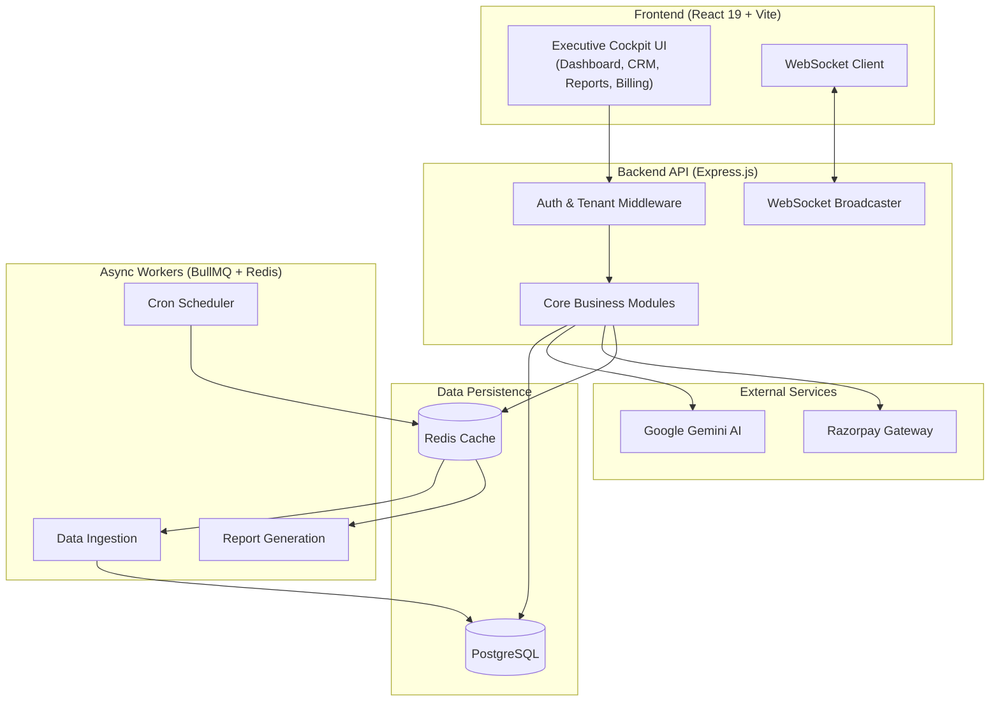

<div align="center">

# 🚀 DecisionOS

### *Enterprise AI-Powered Business Intelligence & Predictive Analytics Operating System*

[](leave it i will add later)
[](https://nodejs.org/)
[](https://reactjs.org/)
[](https://vitejs.dev/)
[](https://supabase.com/)
[](https://upstash.com/)
[](https://ai.google.dev/)
[](https://razorpay.com/)
[](https://bullmq.io/)
[](https://www.docker.com/)

---

[Overview](#-overview) • [Key Capabilities](#-key-capabilities) • [System Architecture](#-system-architecture) • [Frontend Cockpit](#-frontend-cockpit) • [Tech Stack](#-tech-stack) • [Quick Start](#-quick-start-local-development) • [API Reference](#-api-reference)

---

</div>

> [!NOTE]
> **DecisionOS** is a comprehensive, enterprise-grade, multi-tenant SaaS platform designed to unify disparate operational data—such as spreadsheets, sales logs, and inventory metrics—into a singular executive decision intelligence cockpit. Engineered with **React 19**, **Express.js**, **PostgreSQL**, **Google Gemini 3.6 Flash**, **BullMQ asynchronous processing**, and **WebSocket real-time streaming**.

---

## 🌟 Overview

Modern enterprises frequently encounter friction due to siloed data, undetected inventory shortages, unmonitored customer attrition, and delayed financial insights. **DecisionOS** resolves these critical bottlenecks by providing a centralized, robust intelligence operating system:

- **Enterprise-Grade RESTful API** — Express.js backend integrating Prisma ORM and PostgreSQL with extensive, fully tested endpoints.
- **Dual-Engine Artificial Intelligence** — Leverages Google Gemini 3.6 Flash alongside proprietary heuristic algorithms (Z-score analysis, RFM customer segmentation, linear regression forecasting).
- **Production-Ready Billing Infrastructure** — Integrated Razorpay Checkout supporting UPI, Credit/Debit Cards, and NetBanking, fortified with atomic database transactions, AES-256-GCM encryption, and HMAC-SHA256 signature validation.
- **Real-Time Multi-Tenant Event Streaming** — Sub-second WebSocket broadcasting for inventory alerts, asynchronous job completions, and live notification pushes with uncompromising tenant isolation.
- **Automated Multi-Format Reporting** — Generates executive-styled PDF, multi-sheet Excel (`.xlsx`), and streaming CSV reports via configurable cron schedules with automated cloud retention policies.
- **Resilient Data Ingestion Pipeline** — Fault-tolerant background workers (BullMQ + Redis) featuring fuzzy column mapping, row-level error isolation (`PARTIAL` commits), and downloadable schemas.

---

## 🚀 Key Capabilities

### 📊 Business Data Suite
- **Customer Relationship Management (CRM)**: RFM segmentation, Customer Lifetime Value (LTV) tracking, and churn risk detection.
- **Product & Inventory Management**: SKU velocity tracking, reorder point alerts, stockout warnings, and unit economics visualization.
- **Financial Ledger**: Atomic inventory adjustments and revenue rollups upon transaction commits, with month-over-month expense surge detection.

### 🧠 AI Engine (Gemini 3.6 Flash)
- **Anomaly Detection**: Proactive alerts for revenue degradation, abnormal expense surges (>25%), and inventory risks.
- **Predictive Forecasting**: Multi-month linear regression analysis for forward-looking revenue trajectories.
- **Natural Language Querying**: "Ask DecisionOS" interface for intuitive, conversational querying against live operational data.

### 💳 Billing & Subscriptions
- **Secure Transaction Handling**: HMAC-SHA256 cryptographic verification for webhook integrity.
- **Resource Metering**: Dynamic consumption tracking for Active Seats, AI API interactions, Data Imports, and Storage utilization.

### 📑 Automated Report Engine
- **Vector PDF & Excel Reports**: Rendered executive summaries with KPI metric cards, data tables, and structured `.xlsx` workbooks.
- **Cron Scheduling & Delivery**: Automated background generation with branded HTML email delivery via Resend SMTP.

---

## 🏗️ System Architecture



---

## ⚡ Quick Start (Local Development)

### 🗺️ Local Environment Architecture
When running the platform locally, the services are bound to the following standard ports:

* **Frontend Server (React/Vite)**: `http://localhost:5173`
* **Backend API Server (Express.js)**: `http://localhost:3001`
* **WebSocket Streaming Server**: `ws://localhost:3001/ws`
* **PostgreSQL Database**: Typically bound to `localhost:5432` (or via remote URL like Supabase)
* **Redis Cache & Queue**: Typically bound to `localhost:6379` (or via remote URL like Upstash)

### Prerequisites
- **Node.js**: `v18.0.0` or higher (`v24` recommended)
- **PostgreSQL**: PostgreSQL 15+ 
- **Redis**: Redis 6+ 
- **API Keys**: Google Gemini API Key and Razorpay API credentials.

### 1. Configure and Start the Backend Server

The backend manages all API requests, database interactions, background jobs, and real-time WebSocket connections.

```bash
# Clone the repository
git clone https://github.com/souvikx18/DecisionOS.git
cd DecisionOS/backend

# Install necessary dependencies
npm install

# Configure environment variables
cp .env.example .env
```

**Edit your `backend/.env` file with your specific credentials:**
```env
PORT=3001
API_URL=http://localhost:3001
FRONTEND_URL=http://localhost:5173

# Ensure these point to your running local or cloud instances
DATABASE_URL="postgresql://postgres:<password>@localhost:5432/decisionos"
REDIS_URL="redis://localhost:6379"

# Add your external service keys
GEMINI_API_KEY=your_gemini_key_here
RAZORPAY_KEY_ID=your_razorpay_key_id
RAZORPAY_KEY_SECRET=your_razorpay_secret
```

**Initialize the Database and Start the Server:**
```bash
# Push the Prisma schema to your PostgreSQL database
npm run db:push

# (Optional) Seed the database with initial required data
npm run db:seed

# Start the Express server in development mode
npm run dev
```
*The backend should now be running securely on `http://localhost:3001`.*

### 2. Configure and Start the Frontend Server

The frontend is the React-based Executive Cockpit UI.

```bash
# Open a new terminal window and navigate to the frontend directory
cd DecisionOS/frontend

# Install necessary dependencies
npm install
```

**Configure Frontend Environment:**
Ensure the frontend knows where the backend is located. (Vite uses `localhost:5173` by default and proxies `/api` to `localhost:3001` via `vite.config.js`).

**Start the Frontend Development Server:**
```bash
# Start the Vite server
npm run dev
```
*The frontend should now be accessible at `http://localhost:5173`.*

---

## 🧪 Test Suite

DecisionOS includes an extensive integration and cryptographic test suite to verify system integrity across PostgreSQL, Redis, and Razorpay implementations.

```bash
cd backend

# Execute billing and quota metering test suite
node test/billing.test.js

# Execute cryptographic security test suite
node test/e2ee.test.js
```

---

## 📄 License

Distributed under the **MIT License**.

---

<div align="center">

Engineered with precision for Modern Enterprise & SME Decision Makers.

**DecisionOS** — *Transforming complex data into actionable intelligence.*

</div>
