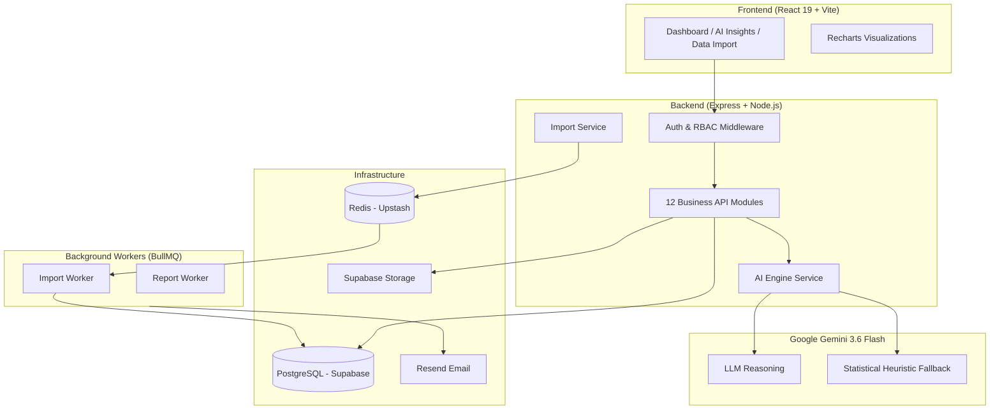

<div align="center">

# DecisionOS

### *AI-Powered Business Intelligence & Predictive Analytics Platform*

[](https://nodejs.org/)
[](https://reactjs.org/)
[](https://supabase.com/)
[](https://upstash.com/)
[](https://ai.google.dev/)
[](https://opensource.org/licenses/MIT)

---

[Overview](#-overview) • [Features](#-platform-features) • [Architecture](#-system-architecture) • [Tech Stack](#-tech-stack) • [Getting Started](#-getting-started) • [API Reference](#-api-reference) • [Test Suite](#-test-suite)

---

</div>

> [!NOTE]
> **DecisionOS** is a full-stack, multi-tenant SaaS platform that transforms fragmented business data into executive intelligence. It connects live transactional data (Sales, Expenses, Inventory, Customers, Products) with a Google Gemini-powered AI engine to deliver anomaly detection, churn prediction, revenue forecasting, and natural-language business Q&A — all behind a role-based access control system built for enterprise teams.

---

## 🌟 Overview

Modern SMEs and enterprises drown in spreadsheets. DecisionOS solves this by providing:

- **A production-grade REST API** (Express + Prisma + PostgreSQL) with 46 fully tested endpoints
- **AI-driven analytics** powered by Google Gemini 3.6 Flash with automatic statistical fallback
- **Background job infrastructure** via BullMQ + Redis for non-blocking data imports
- **Multi-tenant security** with org-scoped data isolation on every single database query
- **A modern React frontend** with glassmorphic dark UI, live charts, and drag-and-drop data import

---

## 🚀 Platform Features

### 📊 Business Data Suite
Five production-grade modules with full CRUD, pagination, filtering, and relational auto-resolution:

| Module | Capabilities |
|---|---|
| **Customers** | CRM with RFM segmentation, churn risk scoring, revenue auto-sync on sale |
| **Products** | Catalogue with SKU uniqueness, category management, cost/margin tracking |
| **Sales** | Transactional ledger with atomic inventory decrement & customer revenue rollup |
| **Expenses** | Category & vendor tracking with month-over-month comparison |
| **Inventory** | Real-time stock levels, reorder alerts, days-to-depletion velocity |
| **Analytics** | Executive P&L summary, revenue trend charts, expense breakdown, top performers |

### 🧠 AI Engine (Google Gemini 3.6 Flash)
- **Anomaly Detection** — Statistical z-score algorithms flag revenue contractions, expense spikes (>25% MoM surge), and inventory stockout risks
- **Customer Churn Matrix** — RFM analysis flags high-value customers with >45 days of inactivity
- **3-Month Revenue Forecast** — Linear regression with trend forward projections and confidence bands
- **"Ask DecisionOS"** — Natural language Q&A against your live business data with structured key metrics and follow-up suggestions
- **Dual-Engine Resiliency** — If the Gemini API is unreachable, the platform automatically switches to the internal heuristic engine. Zero downtime, zero crashes
- **Monthly Usage Quota** — Token consumption tracked per organization with plan-level limits enforced

### 📥 Data Import Pipeline
- **File Upload** — Multer-validated CSV/XLSX ingestion (20MB max, MIME-type whitelist)
- **Smart Column Detection** — Fuzzy header matching for all 5 entity types (handles typos, reordered columns, alternate field names)
- **Background Processing** — BullMQ workers process imports asynchronously with retry logic (3 attempts, exponential backoff)
- **Error Isolation** — Row-by-row validation; valid rows commit, invalid rows are logged (PARTIAL status). No all-or-nothing failures
- **CSV Template Generator** — Pre-formatted downloadable templates for each entity type
- **Status Tracking** — Real-time import status: `PENDING → PROCESSING → COMPLETED / PARTIAL / FAILED`

### 🔐 Authentication & Multi-Tenancy
- **Session-based Auth** — Argon2 password hashing, secure cookie sessions with configurable TTL
- **Organization Isolation** — Every query carries `organizationId` scope. No cross-tenant data leakage is architecturally possible
- **RBAC** — Four roles: `OWNER`, `ADMIN`, `ANALYST`, `VIEWER` with permission gates on every route
- **Invitations** — Email-based org invitations with expiry and single-use tokens
- **Audit Log** — Every write operation is automatically recorded

### 🖥️ Frontend Dashboard
- **Executive Dashboard** — Revenue KPIs, expense breakdown, top customers, inventory alerts, AI health score (0–100)
- **AI Insights Page** — Severity-filtered insight cards (Critical / Warning / Info / Good) with read/dismiss lifecycle
- **Data Import Hub** — Drag-and-drop file upload with column mapping preview and live import status
- **Glassmorphic Dark Mode** — Obsidian Slate dark theme (`#0B0F19`), 16px backdrop blur, animated transitions
- **Recharts Visualizations** — Revenue trend line charts, expense stacked bars, custom tooltips

---

## 🏗️ System Architecture



---

## 🛠️ Tech Stack

### Backend
| Layer | Technology | Version | Purpose |
|---|---|:---:|---|
| Runtime | Node.js | v24 | JavaScript runtime |
| Framework | Express.js | 4.x | HTTP server & routing |
| Database ORM | Prisma | 5.22 | Type-safe PostgreSQL queries |
| Database | PostgreSQL (Supabase) | — | Primary data store |
| Cache / Queue | Redis (Upstash) | — | BullMQ job queue & session store |
| Background Jobs | BullMQ | 6.x | Async import & report workers |
| AI Provider | Google Gemini | 3.6 Flash | LLM analytics & insights |
| Auth | Argon2 + Cookies | — | Secure password hashing & sessions |
| Validation | Zod | 4.x | Runtime schema validation |
| Security | Helmet + express-rate-limit | — | Headers & rate limiting |
| File Parsing | xlsx + csv-parse | — | Excel & CSV ingestion |
| Email | Resend | — | Transactional email delivery |

### Frontend
| Layer | Technology | Version | Purpose |
|---|---|:---:|---|
| Framework | React | 19 | UI rendering |
| Build Tool | Vite | 8.x | HMR & production bundling |
| Styling | Tailwind CSS | 4.x | Utility-first CSS |
| Charts | Recharts | 3.x | Business data visualizations |
| Animations | Framer Motion | 12.x | Smooth UI transitions |
| HTTP Client | Axios | 1.x | REST API communication |
| Routing | React Router DOM | 7.x | Client-side navigation |
| Icons | Lucide React | — | SVG icon library |
| Notifications | react-hot-toast | — | Animated toast feedback |

---

## 📂 Project Structure

```
DecisionOS/
├── 📂 backend/
│   ├── 📂 prisma/
│   │   ├── schema.prisma          # Full DB schema (8 modules, 20+ models)
│   │   └── seed.js                # Plan & super-admin seed data
│   ├── 📂 src/
│   │   ├── 📂 config/
│   │   │   ├── env.js             # Validated env config (Zod)
│   │   │   ├── gemini.js          # Google Gemini client & fallback engine
│   │   │   ├── queue.js           # BullMQ queue definitions
│   │   │   └── redis.js           # IoRedis singleton
│   │   ├── 📂 lib/
│   │   │   ├── aiContextBuilder.js   # Multi-tenant AI context aggregator
│   │   │   ├── anomalyDetector.js    # Statistical anomaly detection algorithms
│   │   │   ├── columnDetector.js     # Fuzzy CSV/XLSX header matcher
│   │   │   ├── crypto.js             # Token generation utilities
│   │   │   ├── fileParser.js         # CSV & Excel streaming parser
│   │   │   ├── forecaster.js         # Linear regression revenue forecaster
│   │   │   ├── prisma.js             # Prisma client singleton
│   │   │   ├── response.js           # Standardized API response helpers
│   │   │   └── templateGenerator.js  # Downloadable CSV template builder
│   │   ├── 📂 middleware/
│   │   │   ├── auth.middleware.js     # Session validation
│   │   │   ├── org.middleware.js      # Organization context injection
│   │   │   ├── rbac.middleware.js     # Role-based permission gates
│   │   │   ├── rateLimit.middleware.js
│   │   │   └── errorHandler.js
│   │   ├── 📂 modules/
│   │   │   ├── 📂 ai/             # AI engine (insights, forecast, ask)
│   │   │   ├── 📂 analytics/      # Executive P&L & chart data
│   │   │   ├── 📂 auth/           # Login, register, session
│   │   │   ├── 📂 customers/      # CRM module
│   │   │   ├── 📂 expenses/       # Expense ledger
│   │   │   ├── 📂 imports/        # Data import pipeline
│   │   │   ├── 📂 inventory/      # Stock management
│   │   │   ├── 📂 invitations/    # Org invitation system
│   │   │   ├── 📂 members/        # Team member management
│   │   │   ├── 📂 organizations/  # Org settings & profile
│   │   │   ├── 📂 products/       # Product catalogue
│   │   │   └── 📂 sales/          # Sales transactions
│   │   ├── 📂 workers/
│   │   │   ├── import.worker.js            # BullMQ import job processor
│   │   │   └── 📂 processors/             # Entity-specific batch processors
│   │   │       ├── customers.processor.js
│   │   │       ├── expenses.processor.js
│   │   │       ├── inventory.processor.js
│   │   │       ├── products.processor.js
│   │   │       └── sales.processor.js
│   │   ├── app.js                 # Express app (middleware + routes)
│   │   └── server.js              # HTTP server entry + graceful shutdown
│   ├── 📂 test/
│   │   ├── business_data.test.js  # 19 tests — Business Data module
│   │   ├── import_pipeline.test.js # 13 tests — Import Pipeline & BullMQ
│   │   └── ai_engine.test.js      # 14 tests — AI Engine & Anomaly Detection
│   └── package.json
│
├── 📂 frontend/
│   └── 📂 src/
│       ├── 📂 components/
│       │   ├── 📂 layout/         # AppLayout, Sidebar, Topbar
│       │   └── 📂 ui/             # StatCard, InsightCard, reusable UI
│       ├── 📂 context/            # AuthContext, ThemeContext, NotificationContext
│       ├── 📂 data/               # Mock data for UI development
│       ├── 📂 pages/              # Dashboard, AIInsights, DataImport, Reports, etc.
│       ├── App.jsx
│       └── index.css              # Global design tokens & CSS variables
│
└── README.md
```

---

## 🚀 Getting Started

### Prerequisites
- **Node.js** `v18+`
- **PostgreSQL** database (or a free [Supabase](https://supabase.com) project)
- **Redis** instance (or a free [Upstash](https://upstash.com) database)
- **Google Gemini API Key** (free at [aistudio.google.com](https://aistudio.google.com/app/apikey))

### 1. Clone the Repository

```bash
git clone https://github.com/souvikx18/DecisionOS.git
cd DecisionOS
```

### 2. Configure Backend Environment

```bash
cd backend
cp .env.example .env
```

Edit `backend/.env`:

```env
# Server
NODE_ENV=development
PORT=3001
FRONTEND_URL=http://localhost:5173

# Database (Supabase PostgreSQL)
DATABASE_URL="postgresql://postgres:<password>@db.<ref>.supabase.co:5432/postgres"

# Redis (Upstash)
REDIS_URL="rediss://default:<password>@<host>.upstash.io:6379"

# Auth
COOKIE_SECRET=<generate with: node -e "console.log(require('crypto').randomBytes(32).toString('hex'))">
SESSION_TTL_SECONDS=604800

# Supabase Storage
SUPABASE_URL=https://<ref>.supabase.co
SUPABASE_ANON_KEY=<your-anon-key>
SUPABASE_SERVICE_KEY=<your-service-role-key>
STORAGE_BUCKET=decisionos-files

# Email (Resend)
RESEND_API_KEY=re_xxxxxxxx
EMAIL_FROM=onboarding@resend.dev

# AI Provider
AI_PROVIDER=gemini
GEMINI_API_KEY=<your-gemini-api-key>
```

### 3. Set Up the Database

```bash
# Install dependencies
npm install

# Push schema to database & generate Prisma client
npm run db:push

# Seed billing plans and super admin
npm run db:seed
```

### 4. Start the Backend

```bash
npm run dev
# Server starts at http://localhost:3001
# BullMQ Import Worker auto-starts alongside the HTTP server
```

### 5. Configure & Start the Frontend

```bash
cd ../frontend
npm install
npm run dev
# Frontend starts at http://localhost:5173
```

---

## 🔑 Environment Variables Reference

| Variable | Required | Description |
|---|:---:|---|
| `DATABASE_URL` | ✅ | PostgreSQL connection string |
| `REDIS_URL` | ✅ | Redis connection string (BullMQ) |
| `COOKIE_SECRET` | ✅ | 32-byte hex string for session signing |
| `GEMINI_API_KEY` | ⚠️ | Google Gemini key. If absent, AI falls back to statistical engine |
| `SUPABASE_URL` | ✅ | Supabase project URL (file storage) |
| `SUPABASE_SERVICE_KEY` | ✅ | Supabase service role key |
| `RESEND_API_KEY` | ⚠️ | Resend key for email delivery |
| `STRIPE_SECRET_KEY` | ⚠️ | Stripe key for billing (optional for dev) |

---

## 📡 API Reference

All endpoints are prefixed with `/api/v1`. Authentication is session-cookie based.

### Auth
| Method | Endpoint | Description |
|---|---|---|
| `POST` | `/auth/register` | Create account |
| `POST` | `/auth/login` | Start session |
| `POST` | `/auth/logout` | End session |
| `GET` | `/auth/me` | Get current user profile |

### Organizations & Members
| Method | Endpoint | Description |
|---|---|---|
| `POST` | `/organizations` | Create organization |
| `GET` | `/organizations/:id` | Get org details |
| `GET` | `/members` | List team members |
| `DELETE` | `/members/:id` | Remove member |
| `POST` | `/invitations` | Send org invitation |

### Business Data
| Method | Endpoint | Description |
|---|---|---|
| `GET/POST` | `/customers` | List / Create customers |
| `GET/PATCH/DELETE` | `/customers/:id` | Manage customer |
| `GET/POST` | `/products` | List / Create products |
| `GET/POST` | `/sales` | List / Record sales |
| `GET/POST` | `/expenses` | List / Record expenses |
| `GET/POST` | `/inventory` | List / Create inventory items |
| `PATCH` | `/inventory/:id/adjust` | Adjust stock quantity |

### Analytics
| Method | Endpoint | Description |
|---|---|---|
| `GET` | `/analytics/summary` | Executive P&L summary |
| `GET` | `/analytics/charts/revenue-trend` | Monthly revenue chart data |
| `GET` | `/analytics/charts/expense-breakdown` | Expense category breakdown |

### AI Engine
| Method | Endpoint | Description |
|---|---|---|
| `POST` | `/ai/generate` | Trigger AI insight generation |
| `GET` | `/ai/insights` | List insights (filter by type/severity) |
| `GET` | `/ai/insights/summary` | Business health score + counts |
| `PATCH` | `/ai/insights/:id/read` | Mark insight as read |
| `PATCH` | `/ai/insights/:id/dismiss` | Dismiss insight |
| `POST` | `/ai/ask` | Natural language business Q&A |
| `GET` | `/ai/forecast/revenue` | 3-month predictive revenue forecast |
| `GET` | `/ai/usage` | Monthly AI token usage & quota |

### Data Imports
| Method | Endpoint | Description |
|---|---|---|
| `POST` | `/imports/upload` | Upload CSV/XLSX file |
| `POST` | `/imports/preview` | Extract 5-row preview + detect columns |
| `POST` | `/imports/:id/start` | Start background import job |
| `GET` | `/imports/:id/status` | Poll import job status |
| `GET` | `/imports/templates/:type` | Download CSV template |

---

## 🧪 Test Suite

DecisionOS ships with a comprehensive integration test suite. All tests run against a live database and server — no mocks.

```bash
cd backend

# Start the server (required before running tests)
npm run dev &

# Run individual test suites
node test/business_data.test.js      # Business Data Module
node test/import_pipeline.test.js    # Import Pipeline & BullMQ
node test/ai_engine.test.js          # AI Engine & Anomaly Detection
```

### Test Results

| Test Suite | Tests | Status |
|---|:---:|:---:|
| **Business Data** (Customers, Products, Sales, Expenses, Inventory, Analytics) | 19 | ✅ 19/19 PASSED |
| **Data Import Pipeline** (CSV, XLSX, BullMQ, Error Isolation) | 13 | ✅ 13/13 PASSED |
| **AI Engine** (Anomaly Detection, Forecasting, Ask DecisionOS, Usage Tracking) | 14 | ✅ 14/14 PASSED |
| **Total** | **46** | ✅ **46/46 PASSED** |

### What Each Suite Tests

**`business_data.test.js`** — Multi-tenant CRUD operations, duplicate SKU rejection, atomic sale processing (auto-decrements inventory + auto-syncs customer revenue), analytics aggregations.

**`import_pipeline.test.js`** — File upload validation, smart column auto-detection, BullMQ background job lifecycle, row-by-row error isolation (PARTIAL status), Excel (.xlsx) processing.

**`ai_engine.test.js`** — Inventory stockout anomaly detection, expense spike detection (Logistics category surge), high-value customer churn risk flagging, executive insights summary & health score, insight filtering, read/dismiss lifecycle, natural language Q&A, 3-month revenue forecast curve, AI usage quota tracking.

---

## 🏛️ Data Architecture

```
Organization (Multi-tenant root)
├── Members (OWNER / ADMIN / ANALYST / VIEWER)
├── Invitations
│
├── Customers → linked to → Sales
├── Products  → linked to → Sales, InventoryItems
├── Sales     → auto-updates → Customer.totalRevenue, InventoryItem.quantity
├── Expenses
├── InventoryItems
│
├── DataImports → UploadedFiles
│   └── Processed by BullMQ Workers → Creates Sales / Expenses / Inventory records
│
├── AiInsights (generated by AI Engine)
├── AiUsage   (token consumption tracking)
│
├── Reports → ReportExports (PDF, CSV, XLSX — Supabase Storage)
│
├── Notifications
├── AuditLogs
└── Subscription → Plan (FREE / PRO / ENTERPRISE)
```

---

## 🛡️ Security Architecture

| Control | Implementation |
|---|---|
| **Password Security** | Argon2id hashing (industry gold standard) |
| **Session Security** | Signed HTTP-only cookies, configurable TTL, server-side session store |
| **Multi-Tenant Isolation** | Every Prisma query scoped by `organizationId`. Cross-tenant access is architecturally impossible |
| **RBAC** | `requirePermission()` middleware on every write endpoint |
| **Rate Limiting** | `express-rate-limit` on all public and authenticated routes |
| **Security Headers** | Helmet.js with strict CSP, X-Frame-Options, HSTS |
| **Input Validation** | Zod schemas on every API request body and query string |
| **File Upload Safety** | MIME-type whitelist, 20MB size cap, file extension validation |
| **Audit Trail** | Every destructive action logged to `AuditLog` with user + IP |

---

## 📄 License

Distributed under the **MIT License**. See `LICENSE` for more information.

---

<div align="center">

Built with precision for Enterprise & SME Decision Makers

**DecisionOS** — *Turn data into decisions*

</div>
