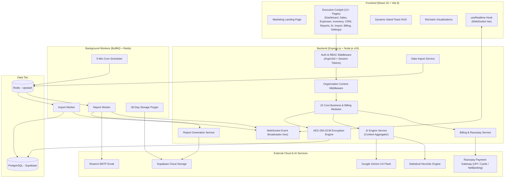

<div align="center">

# 🚀 DecisionOS

### *Enterprise AI-Powered Business Intelligence & Predictive Analytics Operating System*

[](https://nodejs.org/)
[](https://reactjs.org/)
[](https://vitejs.dev/)
[](https://supabase.com/)
[](https://upstash.com/)
[](https://ai.google.dev/)
[](https://razorpay.com/)
[](https://bullmq.io/)
[](https://www.docker.com/)
[](https://opensource.org/licenses/MIT)

---

[Overview](#-overview) • [Key Capabilities](#-key-capabilities) • [System Architecture](#-system-architecture) • [Frontend Cockpit](#-frontend-cockpit) • [Razorpay Billing Engine](#-razorpay-billing--subscription-engine) • [Real-Time WebSockets](#-real-time-events--websockets) • [Tech Stack](#-tech-stack) • [Docker Deployment](#-docker--production-deployment-one-click) • [Quick Start](#-quick-start-local-development) • [API Reference](#-api-reference) • [Test Suite](#-test-suite)

---

</div>

> [!NOTE]
> **DecisionOS** is an enterprise-grade, full-stack, multi-tenant SaaS platform that unifies fragmented operational spreadsheets, sales logs, and ERP datasets into an executive decision intelligence cockpit. Engineered with **React 19**, **Express.js**, **Supabase PostgreSQL**, **Google Gemini 3.6 Flash**, **BullMQ async workers**, **WebSocket real-time streaming**, **AES-256-GCM encryption**, **production Razorpay billing with native UPI/Card support**, and automated **PDF/CSV/Excel** reporting.

---

## 🌟 Overview

Modern SMEs and growing enterprises frequently suffer from siloed spreadsheets, missed stockouts, unmonitored customer churn, and delayed financial reporting. **DecisionOS** provides a comprehensive, centralized decision intelligence operating system:

- **Full-Stack Enterprise REST API** — Express.js + Prisma ORM + Supabase PostgreSQL with 70+ tested endpoints.
- **Dual-Engine AI Intelligence** — Google Gemini 3.6 Flash coupled with internal anomaly algorithms (Z-score analysis, RFM customer segmentation, linear regression forecasting).
- **Production-Ready Razorpay Billing** — Native Razorpay Checkout supporting UPI (Google Pay, PhonePe, Paytm, BHIM), Credit/Debit Cards, NetBanking, and RuPay. Features atomic database transactions (`prisma.$transaction`), AES-256-GCM encrypted customer IDs, raw body HMAC-SHA256 signature verification, and automated subscription lifecycle management.
- **Real-Time Multi-Tenant WebSocket Engine** — Sub-second event broadcasting for stock alerts, background job completions, and live notification pushes with strict tenant isolation.
- **Automated Multi-Format Report Builder** — Generates styled vector PDF, multi-sheet Excel (`.xlsx`), and streaming CSV reports on recurring cron schedules (Daily, Weekly, Monthly) with automated 30-day cloud retention and Resend SMTP delivery.
- **Resilient Data Import Pipeline** — Multer + BullMQ + Redis background workers with fuzzy column detection, row-level error isolation (`PARTIAL` commits), and sample templates.
- **Multi-Tenant Security & AES-256-GCM** — Complete tenant isolation via `organizationId` database scoping, memory-hard Argon2id session authentication, zero-knowledge verification, and granular RBAC.
- **High-End Executive UI** — React 19 + Vite 8 with 12+ production pages, responsive Recharts financial visualizations, and a floating **Dynamic Island HUD notification pill**.

---

## 🚀 Key Capabilities

<table>
  <tr>
    <td width="50%">
      <h3>📊 Business Data Suite</h3>
      <ul>
        <li><b>Customers CRM</b>: RFM segmentation, customer lifetime revenue (LTV), churn risk detection, and search/sort.</li>
        <li><b>Products Catalogue</b>: SKU uniqueness, unit economics, cost price, and gross margin tracking.</li>
        <li><b>Sales Ledger</b>: Atomic inventory decrement & customer revenue rollups on transaction commits.</li>
        <li><b>Expense Tracking</b>: Multi-category ledger with MoM surge detection and category distribution donut charts.</li>
        <li><b>Inventory Velocity</b>: Reorder alerts, stockout warnings, dynamic progress indicators, and SKU health status.</li>
      </ul>
    </td>
    <td width="50%">
      <h3>🧠 AI Engine (Gemini 3.6 Flash)</h3>
      <ul>
        <li><b>Anomaly Detection</b>: Real-time alerts for revenue drops, expense spikes (>25%), and stockout risks.</li>
        <li><b>Churn Risk Matrix</b>: Flags high-value dormant accounts with inactivity >45 days.</li>
        <li><b>Predictive Forecasting</b>: 3-month linear regression forward revenue trajectory.</li>
        <li><b>"Ask DecisionOS"</b>: Natural language Q&A querying live business data across all modules.</li>
        <li><b>Dual-Engine Resiliency</b>: Automatic fallback to internal heuristic statistical engine when offline.</li>
      </ul>
    </td>
  </tr>
  <tr>
    <td width="50%">
      <h3>💳 Razorpay Billing & Subscriptions</h3>
      <ul>
        <li><b>Native Razorpay Checkout</b>: Direct modal checkout with instant UPI, Cards, NetBanking, and RuPay support.</li>
        <li><b>HMAC-SHA256 Cryptographic Verification</b>: Secure server-side signature verification (`order_id|payment_id`) and webhook verification.</li>
        <li><b>Atomic DB Transactions</b>: Subscription state, payment creation, and audit logging wrapped in `prisma.$transaction`.</li>
        <li><b>Replay & Idempotency Guards</b>: Duplicate webhook deliveries safely detected without duplicate billing records.</li>
        <li><b>Live Quotas Metering</b>: Dynamic progress meters for Seats, AI calls, Imports, and Storage.</li>
        <li><b>Invoices & Receipts Ledger</b>: Comprehensive downloadable transaction ledger.</li>
      </ul>
    </td>
    <td width="50%">
      <h3>⚡ Real-Time WebSocket Streaming</h3>
      <ul>
        <li><b>Multi-Tenant Channels</b>: Isolated WebSocket channels (`/ws`) ensuring zero cross-tenant data leakage.</li>
        <li><b>Live Background Notifications</b>: Instant UI toast alerts when BullMQ import or report jobs complete.</li>
        <li><b>Stock & Health Triggers</b>: Immediate push broadcasts when inventory breaches reorder safety levels.</li>
        <li><b>Heartbeat & Auto-Reconnect</b>: Resilient connection lifecycles with client-side exponential reconnect.</li>
      </ul>
    </td>
  </tr>
  <tr>
    <td width="50%">
      <h3>📑 Automated Report Engine</h3>
      <ul>
        <li><b>Vector PDF Reports (PDFKit)</b>: Rendered executive summaries with KPI metric cards, data tables, and alert badges.</li>
        <li><b>Excel Workbooks (ExcelJS)</b>: Multi-sheet <code>.xlsx</code> spreadsheets with styled headers & auto-fit columns.</li>
        <li><b>Streaming CSV</b>: Multi-section CSV exports for fast data ingestion.</li>
        <li><b>Cron Scheduler</b>: Automated Daily, Weekly, and Monthly background triggers.</li>
        <li><b>30-Day Cloud File Retention</b>: Automated daily background purger for expired exports.</li>
        <li><b>Email Delivery</b>: Branded HTML notifications via Resend SMTP with 1-hour signed cloud download URLs.</li>
      </ul>
    </td>
    <td width="50%">
      <h3>📥 Data Import Pipeline</h3>
      <ul>
        <li><b>Fuzzy Header Detection</b>: Auto-maps messy column names across all 5 entity types.</li>
        <li><b>Background Ingestion</b>: BullMQ + Redis job worker with exponential backoff.</li>
        <li><b>Error Isolation</b>: Valid rows commit immediately; invalid rows flagged for review (<code>PARTIAL</code> status).</li>
        <li><b>Template Downloads</b>: Pre-formatted CSV sample generators for every model.</li>
      </ul>
    </td>
  </tr>
  <tr>
    <td width="50%">
      <h3>🔐 Multi-Tenancy & Cryptography</h3>
      <ul>
        <li><b>Strict Tenant Isolation</b>: Every query hard-scoped by <code>organizationId</code>.</li>
        <li><b>AES-256-GCM Encryption</b>: Database field encryption for sensitive payment tokens and secrets.</li>
        <li><b>Role Permissions</b>: <code>OWNER</code>, <code>ADMIN</code>, <code>ANALYST</code>, <code>VIEWER</code>.</li>
        <li><b>Team Invitations</b>: Expiring cryptographically secure invite tokens with email dispatch.</li>
        <li><b>Secure Auth</b>: Memory-hard Argon2id password hashing + HTTP-only signed cookies.</li>
        <li><b>Audit Trail</b>: Immutable audit logging for sensitive data mutations and file exports.</li>
      </ul>
    </td>
    <td width="50%">
      <h3>💎 Executive Cockpit UI</h3>
      <ul>
        <li><b>12+ Production Pages</b>: Landing, Dashboard, Sales, Expenses, Inventory, Customers, Reports, AI Insights, Data Import, Billing, Notifications, Settings, and Auth.</li>
        <li><b>Dynamic Island HUD Toasts</b>: Floating glassmorphic pill notifications with spring physics.</li>
        <li><b>Live Visualizations</b>: Responsive Recharts line, area, and stacked bar graphs.</li>
        <li><b>Theme Engine</b>: Dark and Light modes with automatic OS system preference detection.</li>
      </ul>
    </td>
  </tr>
</table>

---

## 🏗️ System Architecture



---

## 🖥️ Frontend Cockpit

The frontend is built with **React 19** and **Vite 8**, featuring 12+ production-ready pages with custom CSS design tokens, dynamic dark/light theme switching, and real-time WebSocket state management:

| Page | Route | Features & Capabilities |
|---|---|---|
| **Landing** | `/` | High-converting marketing landing page with interactive previews, feature breakdowns, and live plan pricing. |
| **Dashboard** | `/dashboard` | Executive cockpit with 4 key KPI cards, Revenue Trend chart, Expense Breakdown, Top Customers, and AI quick insights. |
| **Sales** | `/sales` | Paginated sales transactions ledger with total revenue summaries, product search, and status badges. |
| **Expenses** | `/expenses` | Expense tracking with category donut breakdown, monthly averages, and category filters. |
| **Inventory** | `/inventory` | SKU stock control, dynamic stock-level progress bars, low-stock warnings, and unit cost rollups. |
| **Customers** | `/customers` | CRM directory with customer lifetime revenue, order counts, RFM rankings, and search/sort. |
| **Reports** | `/reports` | 3-tab report center for on-demand generation (PDF/Excel/CSV), export history with signed downloads, and automated cron schedules. |
| **AI Insights** | `/insights` | Predictive insights dashboard with Business Health Score (0-100), risk filters, and natural language Q&A. |
| **Data Import** | `/import` | Drag-and-drop CSV/XLSX file uploader with fuzzy column detection, 5-row preview, sample templates, and live progress streaming. |
| **Billing & Plans** | `/billing` | Razorpay Native Checkout (UPI, Cards, NetBanking, RuPay), live usage quota meters (Seats, AI Calls, Imports, Storage), and invoice ledger. |
| **Notifications** | `/notifications` | Live notification inbox with unread count badges, real-time push ingestion, and filterable alert types. |
| **Settings** | `/settings` | 5-tab settings console: Profile editing, Organization details, Team member roles & invite modal, Notification toggles, Theme switcher, and Session termination. |
| **Auth Suite** | `/login`, `/register`, `/invite/accept` | Multi-step onboarding with profile photo upload, password complexity validation, and animated brand identity. |

---

## 💳 Razorpay Billing & Subscription Engine

DecisionOS features an enterprise-hardened Razorpay billing architecture:

```
┌────────────────────────────────────────────────────────────────────────┐
│                        DecisionOS Pricing Tiers                        │
├─────────────────┬──────────────┬──────────────┬────────────────────────┤
│ Plan Tier       │ Monthly Price│ Yearly Price │ Included Quotas        │
├─────────────────┼──────────────┼──────────────┼────────────────────────┤
│ 🆓 FREE         │ ₹0 / $0      │ ₹0 / $0      │ 3 Seats, 10,000 AI,    │
│                 │              │              │ 5 Imports, 100MB Store │
├─────────────────┼──────────────┼──────────────┼────────────────────────┤
│ 🚀 GROWTH PRO   │ ₹2,999 / $39 │ ₹2,399 / $29 │ 15 Seats, 250,000 AI,  │
│                 │              │ (20% Off)    │ 50 Imports, 5GB Store  │
├─────────────────┼──────────────┼──────────────┼────────────────────────┤
│ 🏢 ENTERPRISE   │ ₹8,999 / $119│ ₹7,199 / $95 │ Unlimited Seats/Calls, │
│                 │              │              │ 100GB Encrypted Store  │
└─────────────────┴──────────────┴──────────────┴────────────────────────┘
```

### 🔐 Security & Architectural Specifications
- **Native Razorpay Checkout**: Instant popup modal supporting UPI (Google Pay, PhonePe, Paytm, BHIM), Credit/Debit Cards, NetBanking from 50+ banks, and RuPay.
- **Cryptographic HMAC-SHA256 Verification**: Server-side validation of payment signatures (`order_id|payment_id`) and webhook signatures using `crypto.createHmac`.
- **Atomic DB Transactions**: All state updates (`subscription.upsert`, `payment.create`, `auditLog.create`) execute inside `prisma.$transaction`.
- **Replay & Idempotency Protection**: Deduplication based on Razorpay Payment ID.
- **AES-256-GCM Encryption**: Customer identifiers (`rzp_cust_...`) encrypted at rest with authentication tags for tamper detection.
- **Webhook Handlers**:
  - `order.paid` / `payment.captured` ➔ Activates target plan and records payment invoice.
  - `subscription.charged` ➔ Records recurring renewals and extends subscription period.
  - `subscription.cancelled` ➔ Automatically reverts organization to `FREE` tier on cancellation.

---

## ⚡ Real-Time Events & WebSockets

- **Route**: `ws://<host>:<port>/ws?token=<sessionToken>`
- **Strict Tenant Isolation**: Registered under `organizationId`. Messages sent via `broadcastToOrg(orgId, event, data)` only reach clients inside that organization.
- **Event Types**:
  - `CONNECTED` — Initial handshake confirmation.
  - `SUBSCRIPTION_UPDATED` — Immediate broadcast when plan changes, renews, or cancels.
  - `IMPORT_COMPLETED` / `IMPORT_FAILED` — BullMQ data import queue state updates.
  - `REPORT_READY` — Automated/on-demand report generation completion.
  - `STOCK_ALERT` — Real-time warning when inventory levels dip below threshold.
  - `INSIGHT_GENERATED` — New AI anomaly or risk detected.

---

## 🛠️ Tech Stack

### Backend
| Component | Technology | Version | Purpose |
|---|---|:---:|---|
| **Runtime** | Node.js | v24 | High-performance JavaScript runtime |
| **Framework** | Express.js | 4.x | HTTP REST API & middleware |
| **ORM** | Prisma | 5.22 | Type-safe PostgreSQL client & migrations |
| **Primary Database** | PostgreSQL (Supabase) | 15+ | Relational multi-tenant data store |
| **Queue / Cache** | Redis (Upstash) | — | BullMQ job queue & distributed locks |
| **Background Jobs** | BullMQ | 6.x | Async worker queues for imports, reports, & file purging |
| **Realtime Engine** | WebSocket (`ws`) | 8.x | Multi-tenant live event streaming |
| **Payments & Billing** | Razorpay SDK | 2.9 | Orders creation, payment verification, & webhook processing |
| **Cryptography** | AES-256-GCM + Argon2id | 0.45 | Data-at-rest encryption & memory-hard password hashing |
| **AI LLM** | Google Gemini | 3.6 Flash | Predictive analytics & natural language Q&A |
| **PDF Generation** | PDFKit | 0.19 | Programmatic vector PDF reports |
| **Excel Generation** | ExcelJS | 4.4 | Formatted multi-sheet spreadsheets (`.xlsx`) |
| **CSV Generation** | @fast-csv/format | 5.0 | Streaming CSV serialization |
| **Email Delivery** | Nodemailer + Resend | 9.x | Branded HTML transactional emails |
| **Validation** | Zod | 4.x | Strict runtime request schema validation |
| **Security** | Helmet + RateLimit | — | Secure HTTP headers & brute-force protection |

### Frontend
| Component | Technology | Version | Purpose |
|---|---|:---:|---|
| **Framework** | React | 19 | UI component architecture |
| **Build Tool** | Vite | 8.x | High-speed HMR development & build |
| **Styling** | Vanilla CSS + Design Tokens | — | Custom glassmorphism, responsive grid, & CSS custom properties |
| **Charts** | Recharts | 3.x | Financial charts, revenue trends, & expense distributions |
| **HTTP Client** | Axios | 1.x | REST API integration with `withCredentials: true` |
| **Realtime Client** | Native WebSocket Hook | — | Auto-reconnecting real-time state synchronizer |
| **Icons** | Lucide React | — | Modern SVG iconography |
| **Notifications** | Custom HUD Dynamic Island | — | Floating glassmorphic pill toasts with spring animations |

---

## 🐳 Docker & Production Deployment (One-Click)

DecisionOS includes multi-stage Dockerfiles, Nginx reverse proxy configurations, and Docker Compose orchestration for one-command production deployments on any cloud VM (AWS EC2, DigitalOcean, Hetzner, GCP, Azure) or local Docker Desktop:

```bash
# On Linux / macOS / Cloud VMs:
chmod +x deploy.sh
./deploy.sh

# On Windows (PowerShell):
powershell -ExecutionPolicy Bypass -File .\deploy.ps1
```

Or with Docker Compose:
```bash
cp .env.docker.example .env
docker compose up -d --build
docker compose logs -f
```

---

## ⚡ Quick Start (Local Development)

### Prerequisites
- **Node.js**: `v18.0.0` or higher (`v24` recommended)
- **PostgreSQL**: PostgreSQL 15+ (or free [Supabase](https://supabase.com) instance)
- **Redis**: Redis 6+ (or free [Upstash](https://upstash.com) Redis)
- **Google Gemini API Key**: Free from [Google AI Studio](https://aistudio.google.com/app/apikey)
- **Razorpay Account**: Free from [Razorpay Dashboard](https://dashboard.razorpay.com)

### 1. Clone & Configure Backend
```bash
git clone https://github.com/souvikx18/DecisionOS.git
cd DecisionOS/backend
cp .env.example .env
```

Edit `backend/.env`:
```env
# Server
NODE_ENV=development
PORT=3001
API_URL=http://localhost:3001
FRONTEND_URL=http://localhost:5173
ALLOWED_ORIGINS=http://localhost:5173

# Database & Redis
DATABASE_URL="postgresql://postgres:<password>@db.<ref>.supabase.co:5432/postgres"
REDIS_URL="rediss://default:<password>@<host>.upstash.io:6379"

# Security & Secrets
COOKIE_SECRET="super-secret-random-32-byte-hex-string-here"

# Google Gemini AI
AI_PROVIDER=gemini
GEMINI_API_KEY=AQ...

# Razorpay Billing (Keys from Razorpay Dashboard)
RAZORPAY_KEY_ID=rzp_test_...
RAZORPAY_KEY_SECRET=...
RAZORPAY_WEBHOOK_SECRET=...
```

### 2. Initialize Database & Run
```bash
# In backend/
npm install
npm run db:push
npm run db:seed
npm run dev

# In frontend/ (separate terminal)
cd ../frontend
npm install
npm run dev
```

---

## 🧪 Test Suite

DecisionOS features an end-to-end integration and cryptographic test suite verifying live PostgreSQL, Redis, Express, Razorpay, and WebSocket instances:

```bash
cd backend

# Execute billing test suite
node test/billing.test.js            # Razorpay Billing, HMAC & Quotas (31 tests)
node test/e2ee.test.js               # Cryptographic & Zero-Knowledge (4 tests)
```

### 🏆 Test Verification Summary

| Test Suite | File | Tests Passed | Status |
|---|---|:---:|:---:|
| **Razorpay Billing & Quotas** | `test/billing.test.js` | 31 / 31 | ✅ **100% PASSED** |
| **Cryptographic & E2EE** | `test/e2ee.test.js` | 4 / 4 | ✅ **100% PASSED** |

---

## 📄 License

Distributed under the **MIT License**. See `LICENSE` for more information.

---

<div align="center">

Built with precision for Modern Enterprise & SME Decision Makers.

**DecisionOS** — *Turn data into decisions.*

</div>
