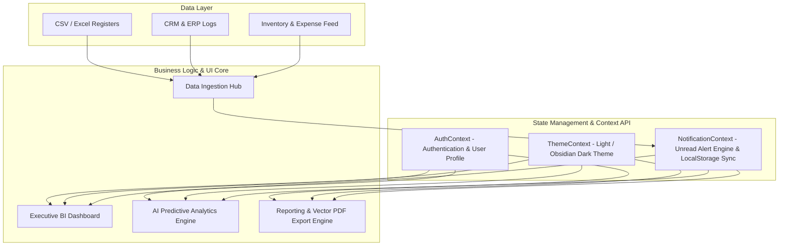

<div align="center">

# 🚀 DecisionOS

### *AI-Powered Business Intelligence & Predictive Analytics Platform for Enterprise & SMEs*

[](https://reactjs.org/)
[](https://vitejs.dev/)
[](https://tailwindcss.com/)
[](https://recharts.org/)
[](https://opensource.org/licenses/MIT)
[](https://github.com/souvikx18/DecisionOS)

---

[Key Features](#-key-features) • [System Architecture](#-system-architecture) • [Tech Stack](#-tech-stack) • [Getting Started](#-getting-started) • [Demo Credentials](#-demo-access-credentials) • [State & Context Architecture](#-state--context-architecture) • [Design System](#-design-system--theme-tokens)

---

</div>

> [!NOTE]
> **DecisionOS** bridges the gap between fragmented raw operational data and executive decision-making. Built specifically for modern enterprises, manufacturing firms, retail, and service businesses, DecisionOS unifies scattered datasets (Excel, CSV, ERP registers, inventory logs) into a real-time executive cockpit with AI-driven risk alerts, churn prediction, and client-side PDF export capabilities.

---

## 🌟 Key Features

<table>
  <tr>
    <td width="50%">
      <h3>📊 Executive Dashboard</h3>
      <ul>
        <li><b>360° Business Visibility</b>: Track total revenue (₹), monthly sales volume, expenses, and inventory alerts.</li>
        <li><b>Predictive Revenue Trend</b>: Actual vs Target performance combined with 2-month AI revenue forecasting.</li>
        <li><b>Expense Breakdown</b>: Multi-category stacked metrics (Logistics, Salaries, Marketing, Operations).</li>
        <li><b>Top Customers & Inventory Status</b>: Live rankings and real-time stock reorder progress bars.</li>
      </ul>
    </td>
    <td width="50%">
      <h3>🧠 AI Insights Engine</h3>
      <ul>
        <li><b>Sales Intelligence</b>: Automated root-cause detection for unexpected revenue changes.</li>
        <li><b>Customer Churn Prevention</b>: Predictive risk alerts for inactive high-value accounts.</li>
        <li><b>Stockout Forecasting</b>: Reorder level alerts with estimated depletion timelines.</li>
        <li><b>Multi-Severity Filters</b>: Categorized by Critical 🔴, Warning 🟡, Info 🔵, and Good 🟢.</li>
      </ul>
    </td>
  </tr>
  <tr>
    <td width="50%">
      <h3>📥 Data Import Engine</h3>
      <ul>
        <li><b>Drag-and-Drop Ingestion</b>: Upload Excel & CSV files for Sales, Inventory, Expenses, and Churn registers.</li>
        <li><b>Schema Validation</b>: Automated column check and progress animation.</li>
        <li><b>Sample Template Downloads</b>: Downloadable pre-formatted CSV templates for quick testing.</li>
      </ul>
    </td>
    <td width="50%">
      <h3>📑 Business Reporting & PDF Export</h3>
      <ul>
        <li><b>Interactive Period Tabs</b>: Instant switching between <i>Daily Summary</i>, <i>Weekly Report</i>, and <i>Monthly Report</i> views.</li>
        <li><b>High-Res PDF Exporter</b>: Client-side vector PDF generation powered by <code>html2canvas</code> and <code>jsPDF</code>.</li>
        <li><b>Performance Benchmarks</b>: Live KPI rollups and client breakdown tables.</li>
      </ul>
    </td>
  </tr>
  <tr>
    <td width="50%">
      <h3>🔔 Smart Notification Center</h3>
      <ul>
        <li><b>Global Context Sync</b>: Real-time notification management via <code>NotificationContext</code> with <code>localStorage</code> persistence.</li>
        <li><b>Dynamic Unread Indicators</b>: Red badge indicator on the topbar bell icon and sidebar navigation menu.</li>
        <li><b>Inbox Controls</b>: Mark single/all as read, dismiss alerts, or clear all entries.</li>
      </ul>
    </td>
    <td width="50%">
      <h3>🌑 Executive Obsidian Dark Mode</h3>
      <ul>
        <li><b>Dual Theme Engine</b>: Seamless toggle between Crisp Light Mode and Deep Obsidian Slate Dark Mode (<code>#0B0F19</code>).</li>
        <li><b>Glassmorphism UI</b>: 16px backdrop blur, subtle top inset edge highlights, glowing indicator badges, and custom dark chart tooltips.</li>
        <li><b>Responsive Drawer</b>: Collapsible desktop sidebar and mobile overlay drawer.</li>
      </ul>
    </td>
  </tr>
</table>

---

## 🏗️ System Architecture



---

## 🛠️ Tech Stack

| Layer | Technology | Purpose & Details |
| :--- | :--- | :--- |
| **Core Framework** | `React 19` + `Vite 6` | High-performance HMR build tooling & component rendering |
| **Routing** | `React Router DOM v7` | Client-side page navigation, nested layouts, and protected routes |
| **Styling Engine** | `Vanilla CSS` + `Tailwind CSS v4` | Dynamic CSS design tokens, custom utility classes, and glassmorphic aesthetics |
| **Charts & Analytics** | `Recharts v3` | Responsive line charts, stacked bar charts, and custom tooltips |
| **Document Export** | `jsPDF` + `html2canvas` | Instant vector PDF compilation for executive reports |
| **State Management** | `React Context API` | Global states for Auth, Theme switching, and Notifications |
| **Iconography & Toasts**| `Lucide React` + `react-hot-toast` | Modern SVG icons and animated toast feedback |

---

## 📂 Project Structure

```bash
DecisionOS/
├── 📂 frontend/
│   ├── 📂 public/                # Static assets, logos, public files
│   ├── 📂 src/
│   │   ├── 📂 assets/            # Brand assets & logos
│   │   ├── 📂 components/        # Reusable UI & layout components
│   │   │   ├── 📂 layout/        # AppLayout, Sidebar, Topbar, ProtectedRoute
│   │   │   └── 📂 ui/            # StatCard, InsightCard, CustomToast
│   │   ├── 📂 context/           # React Context Providers
│   │   │   ├── 📄 AuthContext.jsx         # User auth & profile state
│   │   │   ├── 📄 ThemeContext.jsx        # Light / Dark theme engine
│   │   │   └── 📄 NotificationContext.jsx # Notification hub state & persistence
│   │   ├── 📂 data/              # Mock datasets (Revenue, Sales, Inventory, AI Insights)
│   │   ├── 📂 pages/             # View Controllers
│   │   │   ├── 📂 Auth/          # Login & Register views
│   │   │   ├── 📄 AIInsights.jsx # Predictive analytics & risk alerts
│   │   │   ├── 📄 Dashboard.jsx  # Primary executive BI dashboard
│   │   │   ├── 📄 DataImport.jsx # Drag-and-drop data ingestion hub
│   │   │   ├── 📄 Landing.jsx    # Public product showcase landing page
│   │   │   ├── 📄 Notifications.jsx # Notification inbox manager
│   │   │   └── 📄 Reports.jsx    # Business report view & PDF exporter
│   │   ├── 📄 App.jsx            # Main app router & provider wrapper
│   │   ├── 📄 main.jsx           # Application DOM entry point
│   │   └── 📄 index.css          # Global design tokens & theme variables
│   ├── 📄 package.json
│   └── 📄 vite.config.js
└── 📄 README.md
```

---

## 🚀 Getting Started

### Prerequisites

Ensure you have the following installed on your development machine:
- **Node.js**: `v18.0.0` or higher
- **npm**: `v9.0.0` or higher

### Installation & Run

1. **Clone the Repository**
   ```bash
   git clone https://github.com/souvikx18/DecisionOS.git
   cd DecisionOS
   ```

2. **Navigate to Frontend**
   ```bash
   cd frontend
   ```

3. **Install Dependencies**
   ```bash
   npm install
   ```

4. **Start Development Server**
   ```bash
   npm run dev
   ```

5. **Build for Production**
   ```bash
   npm run build
   ```

---

## 🔑 Demo Access Credentials

> [!IMPORTANT]
> DecisionOS features a built-in mock authentication provider for instant evaluation. Use the following credentials to access the executive suite:

| Field | Credential |
| :--- | :--- |
| **Email Address** | `admin@acmecorp.com` |
| **Password** | *Any password (e.g. `admin123`)* |
| **Access Level** | Executive Administrator |

---

## ⚡ State & Context Architecture

DecisionOS uses React Context Providers to maintain seamless global state across all components:

- **`AuthProvider`** (`AuthContext.jsx`): Manages authentication state, user session profile, and login/logout handlers.
- **`ThemeProvider`** (`ThemeContext.jsx`): Manages theme state (`light` / `dark`), persisting preferences in `localStorage` and toggling `data-theme="dark"` on `<html>`.
- **`NotificationProvider`** (`NotificationContext.jsx`): Centralized store for notification items, tracking `unreadCount` and `hasUnread` boolean flag. Automatically updates topbar bell icon and sidebar navigation badge.

---

## 🎨 Design System & Theme Tokens

Built with dynamic CSS custom properties for instant theme switching:

| CSS Variable Token | Light Mode | Obsidian Dark Mode | Application |
| :--- | :--- | :--- | :--- |
| `--bg-canvas` | `#EBF0F5` | `#0B0F19` | Application backdrop |
| `--bg-sidebar` | `#FFFFFF` | `#111827` | Navigation drawers & header |
| `--bg-card` | `rgba(255, 255, 255, 0.45)` | `rgba(17, 24, 39, 0.7)` | Frosted glass cards |
| `--accent-primary` | `#1D4ED8` | `#1D4ED8` / `#3B82F6` | Primary action buttons & active states |
| `--accent-success` | `#10B981` | `#34D399` | Revenue target achievement & stock OK |
| `--accent-warning` | `#F59E0B` | `#FBBF24` | Customer churn risk & stock reorder warnings |
| `--accent-error` | `#EF4444` | `#F87171` | Stockout alerts & expense spikes |

---

## 📄 License

Distributed under the **MIT License**. See `LICENSE` for more information.

<div align="center">

---

Made with ❤️ for Enterprise & SME Decision Makers by ** Souvik's- DecisionOS Team**

</div>
