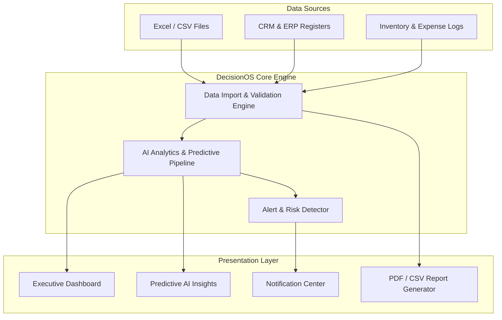

<div align="center">

# 🚀 DecisionOS

### *AI-Powered Business Intelligence & Predictive Analytics Platform for SMEs*

[](https://reactjs.org/)
[](https://vitejs.dev/)
[](https://tailwindcss.com/)
[](https://recharts.org/)
[](https://opensource.org/licenses/MIT)
[](http://makeapullrequest.com)

---

[Key Features](#-key-features) • [System Architecture](#-system-architecture) • [Tech Stack](#-tech-stack) • [Quick Start](#-quick-start) • [Demo Credentials](#-demo-access-credentials) • [Design System](#-design-system--theme-tokens) • [Roadmap](#-product-roadmap)

---

</div>

> [!NOTE]
> **DecisionOS** bridges the gap between raw corporate data and strategic decision-making. Built specifically for manufacturing, retail, distribution, and service enterprises, it harmonizes fragmented data sources (Excel, CSV, CRM, Inventory logs) into real-time executive dashboards with AI-driven risk alerts and actionable growth recommendations.

---

## 🌟 Key Features

<table>
  <tr>
    <td width="50%">
      <h3>📊 Real-Time Executive Dashboard</h3>
      <ul>
        <li><b>360° Revenue Visibility</b>: Track sales metrics, MRR, and quarterly targets.</li>
        <li><b>Operating Expenses</b>: Monitor overhead, category spends, and margin trends.</li>
        <li><b>Top Performers</b>: Live leaderboards for top-performing items and key clients.</li>
      </ul>
    </td>
    <td width="50%">
      <h3>🧠 AI Insights & Predictive Analytics</h3>
      <ul>
        <li><b>Sales Intelligence</b>: Root-cause analysis on revenue declines and market shifts.</li>
        <li><b>Customer Churn Prevention</b>: AI flags inactive accounts before loss occurs.</li>
        <li><b>Stockout Forecasting</b>: Automated purchase order (PO) date suggestions.</li>
        <li><b>Expense Anomaly Detector</b>: Instant alerts on unexpected budget spikes.</li>
      </ul>
    </td>
  </tr>
  <tr>
    <td width="50%">
      <h3>📥 Data Import Engine</h3>
      <ul>
        <li><b>Drag-and-Drop Ingestion</b>: Seamlessly upload Excel & CSV registers.</li>
        <li><b>Schema Validation</b>: Automatic column mapping for Sales, Inventory, and Expenses.</li>
        <li><b>Instant Processing</b>: Immediate dashboard recalculation upon import.</li>
      </ul>
    </td>
    <td width="50%">
      <h3>📑 Business Reporting & Exports</h3>
      <ul>
        <li><b>Executive Summaries</b>: Automated daily rollups and weekly performance cards.</li>
        <li><b>Multi-Format Export</b>: Download board-ready reports in PDF and CSV formats.</li>
        <li><b>Custom Filters</b>: Granular date range and category drill-down analysis.</li>
      </ul>
    </td>
  </tr>
  <tr>
    <td width="50%">
      <h3>🔔 Smart Notification Hub</h3>
      <ul>
        <li><b>Priority Classification</b>: Categorized by Critical 🔴, Warning 🟡, and Info 🔵.</li>
        <li><b>Quick Action Triggers</b>: Re-order stock or send re-engagement emails in 1-click.</li>
        <li><b>Persistent Read State</b>: Sync across all executive devices.</li>
      </ul>
    </td>
    <td width="50%">
      <h3>☀️🌙 Modern UI & Theme System</h3>
      <ul>
        <li><b>Dual Mode Engine</b>: Instant switching between Slate Dark and Crisp Light themes.</li>
        <li><b>Responsive Design</b>: Fluid layouts tailored for Desktop, Tablet, and Mobile.</li>
        <li><b>Glassmorphism Aesthetics</b>: Premium backdrop blurs, soft glows, and elevation.</li>
      </ul>
    </td>
  </tr>
</table>

---

## 🏗️ System Architecture



---

## 🛠️ Tech Stack

| Layer | Technology | Description |
| :--- | :--- | :--- |
| **Frontend Framework** | `React 18 / 19` + `Vite` | Ultra-fast HMR build tooling & component architecture |
| **Styling & UI** | `Vanilla CSS` + `Tailwind CSS v4` | Modern CSS tokens, custom utility classes & glassmorphism |
| **Data Visualization**| `Recharts` | Responsive area charts, bar graphs, pie charts, and sparklines |
| **Animations** | `Framer Motion` | Fluid page transitions, micro-interactions, and modal entry |
| **Icons** | `Lucide React` | Clean, lightweight vector iconography |
| **Document Generation**| `jsPDF` + `html2canvas` | Dynamic client-side PDF export for business reports |
| **Routing & Auth** | `React Router v7` + `Context API` | Client-side routing, protected routes, and mock auth state |
| **Backend Target** | `Node.js` + `Express` + `PostgreSQL` | API layer target with Prisma ORM & Scikit-Learn AI engine |

---

## 📂 Project Structure

```bash
DecisionOS/
├── 📂 frontend/
│   ├── 📂 public/                # Favicons, web manifest, static assets
│   ├── 📂 src/
│   │   ├── 📂 assets/            # Brand logos, high-res vectors, icons
│   │   ├── 📂 components/        # Modular UI components
│   │   │   ├── 📂 common/        # Buttons, Modals, Cards, Dropdowns, Inputs
│   │   │   └── 📂 layout/        # AppLayout, Sidebar, Topbar, ProtectedRoute
│   │   ├── 📂 context/           # React Context (AuthContext, ThemeContext)
│   │   ├── 📂 data/              # Mock datasets for offline demo & testing
│   │   ├── 📂 pages/             # View Controllers
│   │   │   ├── 📂 Auth/          # Login & Registration views
│   │   │   ├── 📄 AIInsights.jsx # Predictive analytics & anomaly engine
│   │   │   ├── 📄 Dashboard.jsx  # Main executive BI dashboard
│   │   │   ├── 📄 DataImport.jsx # Drag-and-drop CSV/Excel import center
│   │   │   ├── 📄 Landing.jsx    # Product landing & marketing page
│   │   │   ├── 📄 Notifications.jsx # Smart notification management center
│   │   │   └── 📄 Reports.jsx    # Business performance reporting & PDF export
│   │   ├── 📄 App.jsx            # Application router & provider setup
│   │   ├── 📄 main.jsx           # Entry point
│   │   └── 📄 index.css          # Design system tokens, light/dark mode variables
│   ├── 📄 package.json
│   └── 📄 vite.config.js
└── 📄 README.md
```

---

## 🚀 Quick Start

### Prerequisites

Make sure you have the following installed on your machine:
- **Node.js**: `v18.0.0` or higher
- **npm**: `v9.0.0` or higher

### Installation Steps

1. **Clone the Repository**
   ```bash
   git clone https://github.com/your-org/DecisionOS.git
   cd DecisionOS
   ```

2. **Navigate to Frontend Directory**
   ```bash
   cd frontend
   ```

3. **Install Dependencies**
   ```bash
   npm install
   ```

4. **Launch Development Server**
   ```bash
   npm run dev
   ```

5. **Access Application**
   Open your browser and navigate to `http://localhost:5174/` (or the port specified in your terminal output).

---

## 🔑 Demo Access Credentials

> [!IMPORTANT]
> DecisionOS includes a built-in mock authentication flow for instant evaluation. Use the credentials below to log in as an administrator:

| Field | Demo Credential |
| :--- | :--- |
| **Email Address** | `admin@acmecorp.com` |
| **Password** | *Any non-empty password* |
| **Default Role** | Executive Administrator |

---

## 🎨 Design System & Theme Tokens

DecisionOS features an adaptive design system built on CSS dynamic tokens supporting full Light and Dark themes.

| CSS Variable Token | Light Theme | Dark Theme | Applied Purpose |
| :--- | :--- | :--- | :--- |
| `--bg-canvas` | `#F8FAFC` | `#0F172A` | Primary application page backdrop |
| `--bg-sidebar` | `#FFFFFF` | `#1E293B` | Navigation drawer, cards, and containers |
| `--accent-primary` | `#1D4ED8` | `#3B82F6` | Primary action buttons, active links, focus rings |
| `--accent-success` | `#10B981` | `#10B981` | Positive revenue indicators & healthy stock |
| `--accent-warning` | `#F59E0B` | `#F59E0B` | Customer churn alerts & stock warnings |
| `--accent-error` | `#EF4444` | `#EF4444` | Stockout alerts & expense overruns |

---

## 🗺️ Product Roadmap

- [x] Executive Dashboard with interactive Recharts
- [x] AI Predictive Insights & Root-Cause Engine Mockup
- [x] CSV / Excel File Drag-and-Drop Parser Interface
- [x] Client-Side PDF & CSV Report Exporter
- [x] Dynamic Light & Dark Mode Engine
- [ ] Integration with PostgreSQL & Prisma ORM backend
- [ ] Live Python FastAPI engine integration for custom ML model inference
- [ ] Multi-tenant organization role management (Admin, Analyst, Viewer)
- [ ] Automated Slack & Email Webhook Alerts

---

## 📄 License

Distributed under the **MIT License**. See `LICENSE` for more details.

<div align="center">

---

Made with ❤️ by the **DecisionOS Team**

</div>
